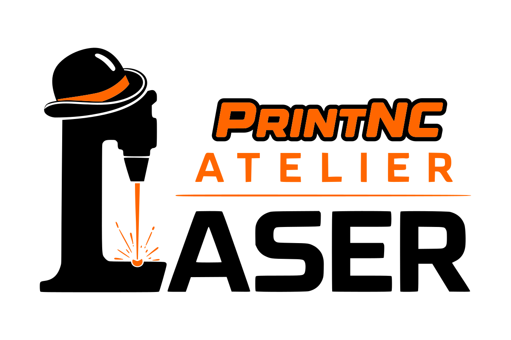
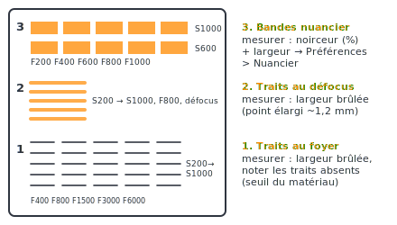
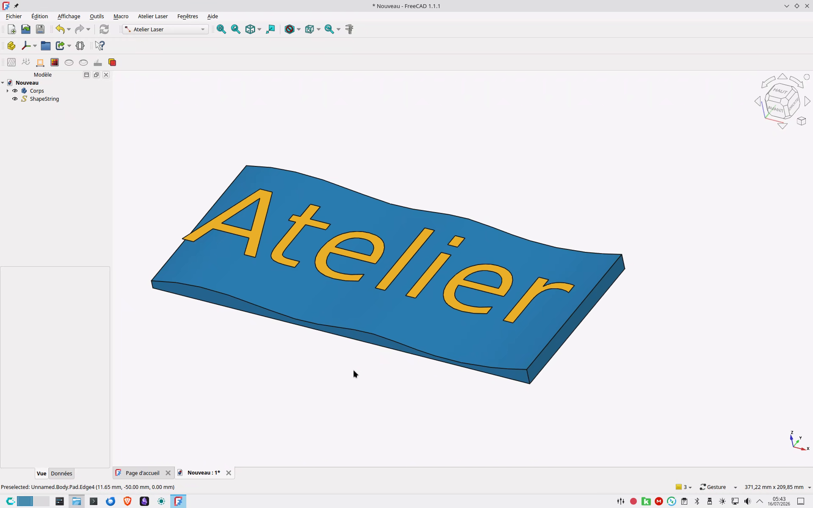
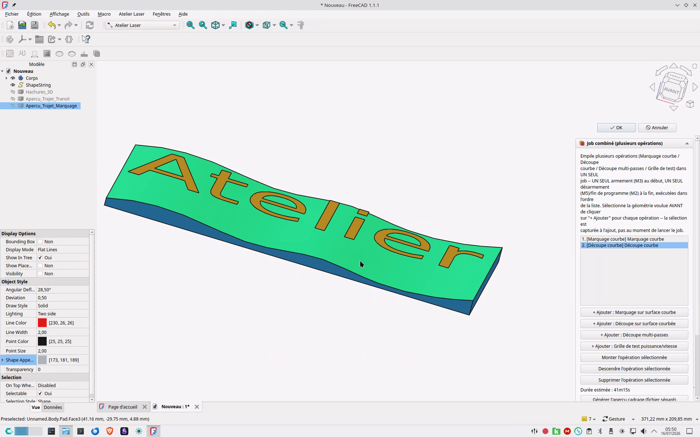
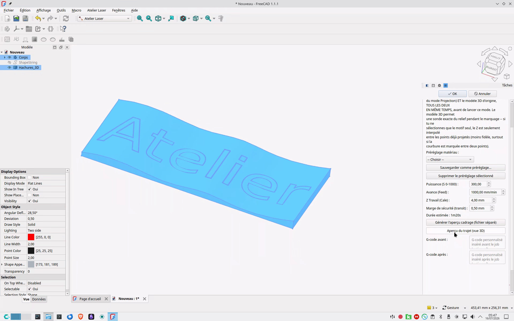
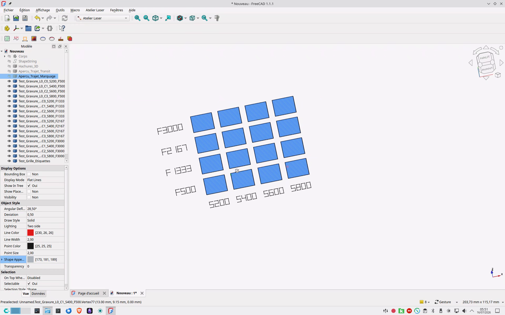

# Atelier Laser

<p align="center"></p>
<p align="center"><br><sub><b>v1.13.0</b> — Le petit chapeau en coin de chaque icône est la signature de l'<a href="https://atelierduverdier.fr">Atelier du Verdier</a>.<br>© Atelier du Verdier — licence <a href="LICENSE">LGPL-2.1-or-later</a>.</sub></p>
<p align="center"><a href="https://ko-fi.com/atelierduverdier"><b>☕ L'atelier vous est utile ? Soutenez-le sur Ko-fi</b></a></p>

Workbench [FreeCAD](https://www.freecad.org/) pour la génération de G-code de marquage/découpe laser : gravure noir plein de textes/formes, suivi de surfaces 3D courbes, découpe multi-passes, grilles de test et de calibration, et jobs combinant plusieurs opérations en une seule passe.

> 📖 **Documentation complète** : une page web autonome présente tout l'atelier (présentation, installation, flux de travail, les 16 modes en images, calibration, préférences, G-code, FAQ) dans [`docs/index.html`](docs/index.html). Elle est prête pour **GitHub Pages** : dans les réglages du dépôt, activer *Pages* → source *Deploy from a branch* → branche `main`, dossier `/docs` ; la doc est alors publiée à l'adresse `https://atelierduverdier.github.io/LaserAtelier/`. Le fichier fonctionne aussi tel quel si on l'ouvre en local ou qu'on copie le dossier `docs/` sur un autre site.

## Fonctionnalités

Les modes sont regroupés par thème dans la barre d'outils et le menu. Le **Guide rapide** (première icône, livre ouvert) résume le flux de travail (calibrer → tester → motif → G-code → cadrage → graver) et « quel mode pour quoi ? » — le point d'entrée pour découvrir l'atelier. **Workflow type** : créer/charger le tracé (SVG, ShapeString, sketch) → le placer en X/Y par rapport au futur zéro pièce → le **projeter** sur la pièce (contrôle visuel : le tracé est posé sur la surface, plate ou 3D) → graver avec **Marquage** (traits, sélectionner le projeté) ou **Gravure remplie** (noir plein, sélectionner la forme fermée *source*). La hauteur Z du document est visuelle : le G-code suppose toujours zéro Z machine sur la surface gravée, et un job = une seule surface de référence. Chaque panneau ouvre sur un résumé court avec un bouton « En savoir plus » (détails repliés) et, pour les concepts clés, un petit schéma explicatif (cône de défocus, axes de la grille, rampe, projection…).

**Gravure à plat**
- **Hachures 2D (géométrie)** : remplissage (parallèles / croisées / défocus) sur une face 2D — crée la géométrie des hachures Option **contour** : le bord de la forme (trous compris) est ajouté à l'objet créé — hachures + contour gravés en une seule opération Marquage.
- **Gravure remplie (noir)** : grave un texte/forme 2D en **noir plein** — remplissage par hachures en défocus (point élargi, automatiquement **rentré du rayon de point** pour ne pas déborder du bord, avec un liseré qui ferme les blancs le long des bords) **puis** contour repassé net au foyer (épaisseur de trait réglable). Préréglages matériau. **Styles de trait** au choix pour le remplissage et le contour : trait plein, **tirets** (faisceau pulsé, mouvement continu), **pointillé** (vrais points ronds gravés en micro-traits — jamais de pulse G4 faisceau allumé, compatible puissance asservie ; gros points doux en défocus), ou **vague défocus** (le Z oscille entre le foyer et un défocus max : le trait varie continûment en largeur et en intensité, effet calligraphique ; amplitude calculée par la calibration du point, avertissement si la vitesse Z crête dépasse la limite de l'axe). **Remplissage en dégradé** : la puissance varie linéairement le long d'une direction réglable (0° = gauche→droite), de la puissance de remplissage au « S en fin de dégradé » — l'espacement des hachures est resserré sur la brûlure mesurée de la puissance la plus faible pour rester uniforme sur toute la forme.
- **Gravure photo (trame de points)** : convertit une image (PNG/JPG…) en **trame de points laser** — tramage par **diffusion Floyd-Steinberg** (points identiques, la densité rend le gris) ou par **durée de pulse variable** (chaque point dure proportionnellement à la noirceur locale), parcours en serpentin, option négatif pour matériaux foncés, et **largeur du point** réglable (la hauteur de défocus est calculée via la calibration — gros points doux pour trames larges). Troisième tramage : **Lignes calibrées (nuancier)** — la **photo calibrée** : chaque ligne de l'image est balayée **en continu** (G64, serpentin), la puissance S modulée **pixel par pixel** pour viser la noirceur du pixel via la courbe noirceur→fluence des tons **mesurés** du nuancier ; gris fidèles au matériau réel, et bien plus rapide que les points (pas d'arrêt par pixel). Sous la noirceur minimale mesurée, la fluence est prolongée vers 0 (hautes lumières progressives) ; les pixels qui satureraient S max sont plafonnés et comptés en tête du G-code (ralentir la vitesse si trop nombreux). Quatrième tramage : **Diffusion en lignes (points fins, rapide)** — le rendu points du tramage Diffusion, mais balayé **en continu** : le faisceau s'allume/s'éteint par pixel à puissance fixe le long de chaque ligne (G64, serpentin) — l'esthétique des points à la vitesse d'un balayage, point fin au foyer conseillé. Cinquième tramage : **Gros points Z (taille variable, artistique)** — un point par cellule dont le **diamètre** rend la noirceur (petit point net au foyer pour les clairs, gros point défocalisé pour les foncés), la taille venant de la **hauteur Z** (cône calibré), le Z bougeant **entre** les points ; de près un semis de points, de loin l'image. Réglages d'image : **Tonalité (gamma)** avec aperçu en direct (photo saturée = gris trop foncés → gamma 1,5-2), et **Mire des tramages** : le même dégradé de gris gravé par chaque tramage, en bandes étiquetées, pour comparer les styles sur chute. Bouton **Photo de démonstration** : charge la photo de test fournie (Guy de Maupassant par Nadar, 1888, domaine public) pour comparer tramages et tonalité avant d'utiliser ses photos. **Préréglages** (★ d'usine + les tiens) : portrait lignes calibrées (qualité), essai rapide points fins (brouillon), photo points fins (équilibré), gros points Z (artistique) — un clic remplit tous les champs, l'image choisie n'est pas touchée. Les points sont gravés en **micro-traits** (jamais de pulse G4 à l'arrêt) : compatible avec une puissance asservie à la vitesse réelle (HAL PrintNC).

**Sur surface 3D**
- **Projection sur surface 3D** : projette un motif 2D sur une surface courbe (sonde par tessellation, quasi instantanée même sur un remplissage dense). Le panneau s'ouvre d'abord, puis on sélectionne les motifs 2D et la surface 3D dans la vue (état reconnu affiché en direct) avant de valider.
- **Marquage de motif (plat ou courbe)** : grave un motif filaire à plat (motif 2D seul) ou en suivant le relief d'un modèle 3D (sonde par tessellation, ou interpolation), avec préréglages matériau, aperçu du trajet directement dans la vue 3D, et **styles de trait** (plein / tirets / pointillé / vague défocus / **défocus point élargi** / **dégradé Z croissant** — le défocus varie linéairement le long d'une direction réglable, entre deux largeurs de trait : des hachures qui passent du net/dense au large/doux d'un bord à l'autre de la pièce — ce dernier grave le motif au-dessus du foyer pour noircir un remplissage en un passage, l'équivalent du remplissage Défocus des Hachures 2D appliqué au motif projeté ; tous les styles suivent le relief comme le trait plein). **Mire des styles** : le même trait droit gravé par chacun des 6 styles, en bandes étiquetées 1-6, pour choisir un style sur chute de matériau.
- **Découpe multi-passes sur surface courbée** : combine le suivi de relief du marquage courbe avec la logique multi-passes/kerf/imbrication de la découpe à plat.

**Découpe**
- **Découpe multi-passes (matériau plat)** : passes progressives, compensation de kerf, ordre trous-avant-contour, rampe de puissance, dernière passe ralentie. **Attaches (tabs)** : ponts de matière non coupés (nombre/longueur/hauteur réglables) qui retiennent la pièce — et la chute des trous — jusqu'à la fin du job, seules les passes profondes les sautent. **Amorce (lead-in)** : le faisceau s'allume dans la chute (extérieur d'une pièce, intérieur d'un trou) puis rejoint le contour — la verrue d'allumage reste hors du bord fini. **Copies en matrice** : réplique la sélection en n×m au pas choisi pour découper une série en un seul job. Les tracés **ouverts** sont coupés en aller-retour (sens alterné à chaque passe).

**Tests & calibration**
- **Calibration kerf** : deux géométries de test à découper ensuite. Le **carré** sert à *mesurer* le kerf (kerf = taille dessinée − taille mesurée au pied à coulisse). Le **tenon + mortaise** sert à *valider l'ajustement* une fois le kerf connu : un tenon (pièce mâle) et une rangée de mortaises au même nominal mais à jeu croissant — on découpe avec la compensation de kerf trouvée, on insère le tenon dans chaque mortaise et on retient le jeu qui donne le bon ajustement (serré pour un collage, glissant pour du démontable). Le mode crée **deux objets** : **« découpe »** (les contours seuls) et **« gravure »** (le jeu sous chaque mortaise + la cote sur le tenon de référence). Le texte est ainsi *marqué à faible puissance* — opération distincte de la découpe — au lieu d'être coupé : on grave puis on découpe (ou on enchaîne via Job combiné).
- **Grille de test puissance/vitesse** : job unique en grille de cellules à puissance/vitesse variables, avec étiquettes de repérage, **cadre net au foyer** autour de chaque cellule, optimisation du trajet par proximité, remplissage défocus et préréglages matériau. Champ **Hauteur (Z) de test** : par défaut la focale des Préférences, modifiable pour rejouer la même matrice puissance/vitesse à une autre hauteur (bec défocalisé) — on balaie plusieurs hauteurs proprement, une grille par hauteur.
- **Test rampe puissance/vitesse (lignes)** : grave de longues lignes, **une par vitesse**, chacune parcourue avec une puissance qui **monte progressivement** de gauche (min) à droite (max). On lit d'un coup, à chaque vitesse, à partir de quelle puissance le trait commence à marquer et où il sature — le complément **continu** de la grille de cellules discrètes. Option **rampe de hauteur (Z)** : la hauteur du bec monte *aussi* le long de chaque ligne, de la focale (gauche) à une hauteur de fin (droite), en même temps que la puissance — pour tester à chaque vitesse l'effet combiné puissance croissante + défocus croissant. Étiquettes vitesse (F) à gauche, et **règle de graduation de puissance** sous la première ligne : traits verticaux à des valeurs de S rondes (bornes + paliers intermédiaires), valeurs écrites en **chiffres verticaux** (empilés) pour tenir dans l'espacement serré — on lit d'un coup la puissance sous n'importe quel point du trait.
- **Bande de calibration défocus** : grave une rangée de courts traits à hauteurs de bec croissantes, étiquetés en **hauteur** (à gauche) et en **puissance** (à droite), avec **rampe de puissance** optionnelle — pour mesurer le foyer (trait le plus fin) et la divergence du point, et renseigner la calibration défocus une bonne fois. Option **plusieurs bandes** : grave N bandes côte à côte (espacées de 5 mm par défaut), une par **vitesse** (de la première à la dernière, interpolées), chacune étiquetée de sa vitesse — tous les niveaux de gris/noir en un seul job, sans relancer une bande par vitesse.
- **Test des offsets X/Y du laser** : job **mixte fraise + laser** qui fraise une croix centrée sur X0 Y0 puis grave une croix laser au même X0 Y0 programmé — l'écart mesuré entre les deux croix donne directement la correction des offsets X/Y de l'outil laser dans `tool.tbl` (X_nouveau = X_actuel − dX, idem Y). Seul mode de l'atelier à faire ses propres changements d'outil (`T<fraise> M6` puis `T<laser> M6`, glissière laser montée pendant la pause du second) ; les autres modes supposent le `T<laser> M6` déjà fait.

**Assemblage**
- **Job combiné** : assemble plusieurs opérations dans un seul fichier G-code avec un seul armement du laser, transition de sécurité anti-collision entre opérations. On **ajoute chaque opération depuis son vrai mode** : tu ouvres le mode normal (Découpe, Marquage, Gravure remplie, Grille de test…), tu règles tout avec **toutes ses options** (attaches, amorce, copies, styles de trait, compensation de kerf…), puis tu cliques **« ➕ Ajouter au job combiné »** ; le mode Job combiné ne fait plus qu'ordonner la liste et générer le fichier. Pas de fenêtre simplifiée à part — c'est la même fenêtre que d'habitude, donc aucune perte de fonctionnalité.

**Nuancier matériau** : la palette de gris **mesurée** d'un matériau — chaque ton = un réglage (puissance, vitesse, défocus) + son résultat constaté sur chute (noirceur 0-100 % à l'œil, largeur du trait). On l'alimente après les grilles/rampes de test (mode Nuancier, dans Tests & calibration), et les modes **Marquage** et **Gravure remplie** proposent « Appliquer ce ton » : puissance/vitesse (et style Défocus à la largeur mesurée, le cas échéant) réglés d'un clic sur un rendu déjà validé. La noirceur n'étant pas linéaire avec la puissance, le logiciel s'appuie sur ces mesures (ton le plus proche) plutôt que sur un modèle — fondation des futurs dégradés calibrés et photos calibrées. Le Marquage propose en plus un **ton sur mesure interpolé** : on choisit la **largeur de trait** (→ défocus via la calibration du point) et la **noirceur visée** (→ vitesse, interpolée sur la courbe noirceur→fluence construite à partir des tons **mesurés** en défocus, lissée par régression isotone car la noirceur sature avec l'énergie ; bornée aux noirceurs mesurées, jamais extrapolée) — un clic règle style Défocus + largeur + vitesse, à valider sur une chute.

Tous les modes de **test & calibration** (Grille, Rampe, Bande de calibration défocus, Kerf, Offsets) ont un sélecteur de **préréglages** : des **préréglages d'usine** (★, points de départ prêts à l'emploi, non supprimables) qu'on charge d'un clic, plus les siens (sauvegarde/suppression comme les préréglages matériau des autres modes).

Communs à tous les modes : estimation de durée **tenant compte des accélérations** (profil trapézoïdal par course, accélération réglable dans les Préférences — décisif sur les remplissages faits de milliers de traits courts), aperçu de trajet dans la vue 3D, aperçu de cadrage en fichier séparé (avec faisceau de visée à très faible puissance optionnel) pour vérifier le positionnement avant de lancer, préréglages matériau, préférences globales, et **mémorisation des derniers réglages** de chaque panneau (rouvrir un mode retrouve les valeurs de la dernière fois). Mieux : les **réglages sont attachés à la forme** — à la génération, les réglages du panneau sont écrits dans une propriété de l'objet sélectionné, sauvegardée **avec le document** (.FCStd). Rouvrir plus tard le même mode avec cette forme sélectionnée re-propose *ses* réglages (prioritaires sur les derniers réglages globaux) : chaque forme du document garde sa recette de gravure. Et chaque génération crée un objet **Job** dans l'arborescence (« Job Marquage - Logo »…) qui référence la ou les formes sources : **double-clic dessus** = re-sélection des sources et réouverture du panneau pré-rempli, prêt à modifier et régénérer. Un Job par couple mode/forme — et même **par sous-sélection** : deux faces d'un même sketch ou d'un SVG importé peuvent porter deux recettes et deux Jobs distincts (« Job Gravure remplie - Sketch [Face2] »), sans rien séparer à la main. Régénérer met à jour le Job existant, votre renommage est conservé. Jobs et formes sources sont rangés automatiquement dans un dossier **« Atelier Laser »** de l'arborescence, et un bouton dédié empile les **Jobs sélectionnés dans le job combiné** (chacun avec sa recette) pour générer un fichier unique sans rouvrir les panneaux.

## La hiérarchie des tests (nouveau matériau = une planche)

Chaque test alimente le suivant — dans l'ordre :

1. **Une fois par laser** (pas par matériau) : **Bande de calibration défocus** (deux mesures du point → Préférences), puis **Test offsets fraise + laser** (X/Y du laser dans `tool.tbl`).
2. **Nouveau matériau** : bouton **« Planche de calibration matériau »** (panneau Grille de test) → un seul G-code à graver sur une chute ~130 × 125 mm (zéro au coin bas-gauche, sur le dessus). Trois sections numérotées, de bas en haut :
   - **1 — traits au foyer** (5 puissances × 5 vitesses, F400 → F6000 : jusqu'au maxi machine) : mesurer la **largeur brûlée** de chaque trait, noter ceux qui restent vierges (un trait vierge est une donnée : c'est le seuil du matériau) ;
   - **2 — traits au défocus** (5 puissances à F800, point élargi du remplissage) : mesurer les largeurs ;
   - **3 — bandes nuancier** (rectangles remplis au défocus, 2 puissances × 5 vitesses) : estimer la **noirceur** (0–100 %) et mesurer la largeur → saisir chaque bande dans **Préférences > Nuancier**.

   Les largeurs des sections 1–2 se saisissent via **« Saisir les mesures de la planche »** (panneau Grille de test) : elles alimentent l'interpolation largeur(S, F) utilisée par le bouton « Auto (½ point) » des Hachures, et la **Gravure remplie** (style plein) resserre automatiquement l'espacement de ses hachures à la largeur réellement brûlée quand elle est plus étroite que le point optique — c'est ce qui supprime les lignes visibles sur les tons clairs (faibles puissances). Toutes ces données restent dans la config locale (`laser_atelier_config.json`, dossier utilisateur FreeCAD) — rien de spécifique à votre machine ne part avec l'atelier.
3. **Après le nuancier** (facultatif, pour choisir à l'œil) : **Mire des styles** (Marquage) et **Mire des tramages** (Gravure photo).



## Modèle de défocus (remplissage noir)

Pour noircir une surface en un seul passage, le remplissage éloigne le bec du foyer : le point s'élargit et des hachures espacées se recouvrent. Le modèle est un cône de divergence linéaire calibré à partir de **deux mesures réelles** du point (au foyer, puis à un défocus connu) — jamais deviné. La **Bande de calibration défocus** fournit ces mesures ; on les saisit **une seule fois dans les Préférences** (« point au foyer », « défocus de test », « point au défocus de test ») et tous les modes concernés (Hachures 2D, Gravure remplie, Grille de test, style Vague) les réutilisent : l'atelier calcule le défocus nécessaire pour un espacement donné (et rentre le remplissage du rayon de point pour rester dans le contour).

### Puissance vs défocus (fluence)

Défocaliser étale la **même** puissance sur un point plus large : l'énergie déposée par unité de surface (la **fluence**) baisse, et sous un seuil le trait ne marque plus. Pour un trait balayé à la vitesse `v`, avec un point de diamètre `d` et une puissance `P`, la fluence vaut `F ∝ P / (d · v)` (l'aire du point grossit en `d²`, mais le temps de séjour sur chaque point grossit en `d`, d'où le `1/d` net). Les modes **Gravure remplie** et **Marquage (style Défocus)** exposent une section « Puissance vs défocus » : on renseigne un réglage de **référence** connu bon sur le matériau (puissance, vitesse, et **largeur de point** d'une gravure réussie), et l'atelier soit **indique** la fluence obtenue par rapport à cette référence (à ajuster à la main), soit **compense la puissance automatiquement** pour retrouver la même fluence à la largeur de point et à la vitesse courantes (case à cocher). Dans le mode Marquage, on saisit d'ailleurs directement la **largeur du point** voulue (l'atelier en déduit la hauteur de défocus via la calibration), plus intuitif que de régler une remontée de bec. Aucune constante optique absolue n'est supposée — seuls des rapports à un point mesuré, dans l'esprit « on mesure, on ne devine pas » du reste de l'atelier.

## Démo vidéo

[Vidéo de démonstration sur YouTube](https://youtu.be/KP4F4Cd287A)

## Captures d'écran

Chaque panneau de l'atelier est présenté (capture complète) dans la **[galerie des panneaux](docs/panneaux.md)**.

| | |
|---|---|
|  |  |
|  |  |

## Performances

La sonde de hauteur Z (suivi de relief pour le marquage/découpe sur surface courbe et la projection de motifs) utilisait à l'origine une intersection géométrique OpenCascade **par point sondé** (~5 ms chacune) : sur un remplissage dense, cela représentait des dizaines de milliers d'intersections et plusieurs minutes de calcul. Elle repose maintenant sur une **tessellation unique** de la surface suivie d'une interpolation barycentrique par point (quelques microsecondes).

Concrètement :

- **Tessellation unique** : la surface 3D est convertie une seule fois, au début du calcul, en un maillage de petits triangles (comme les facettes d'un modèle pour l'impression 3D). C'est OpenCascade qui s'en charge, en C++, en quelques millisecondes. Les triangles sont ensuite rangés dans une grille XY pour retrouver instantanément ceux qui se trouvent sous un point donné.
- **Interpolation barycentrique par point** : pour connaître la hauteur Z de la surface sous une position (X, Y), il suffit alors de trouver le triangle qui contient ce point (vu de dessus) et de calculer le Z par une moyenne pondérée des hauteurs de ses trois sommets (les "coordonnées barycentriques" : le poids de chaque sommet dépend de la proximité du point à celui-ci). C'est une poignée de multiplications et d'additions — d'où les quelques microsecondes, là où l'ancienne méthode reconstruisait une intersection géométrique complète ligne/solide à chaque point.

L'astuce est donc de payer une fois un petit coût de préparation (le maillage) pour rendre ensuite chaque requête quasi gratuite, au lieu de payer le prix fort à chacune des dizaines de milliers de requêtes.

Mesures sur une plaque ondulée 100×60 mm, hachures espacées de 0,5 mm (~48 000 points de trajectoire) :

| Calcul | Avant | Après | Gain |
|---|---:|---:|---:|
| Projection du motif sur la surface 3D | 66,2 s | 0,06 s | ×1200 |
| G-code marquage courbe (1er calcul) | 107,0 s | 0,18 s | ×600 |
| G-code marquage courbe (recalcul) | 11,8 s | 0,18 s | ×65 |

Les hachures 2D bénéficient de la même approche (clipping paramétrique de chaque ligne sur la tessellation des faces, au lieu d'une opération booléenne par ligne et par face) :

| Calcul | Avant | Après | Gain |
|---|---:|---:|---:|
| Hachures 0,2 mm sur 24 faces à trou | 2,6 s | 0,08 s | ×33 |
| Grille de test 6×6, hachures 0,2 mm | 1,1 s | 0,06 s | ×17 |

La précision est préservée : l'écart Z entre le maillage et la vraie surface est borné à 0,05 mm (constante `MESH_PROBE_DEVIATION_MM`), validé contre l'ancien raycast exact sur 300 points aléatoires (erreur max mesurée : 0,046 mm) — négligeable face à la tolérance de focus du laser (~0,1 mm).

## Matériel testé

Cet atelier a été développé et testé avec le module laser **LT-80W-AA-PRO** (diode 10 W optiques). Les préréglages de hauteur de bec par épaisseur (`FOCUS_TABLE` dans `laser_core.py`) proviennent du tableau constructeur de ce module.

**Modification matérielle importante** : la pièce carrée qui entoure le nez du laser a été **retirée**, afin de pouvoir suivre les surfaces courbes sans collision. Le contrôle de dégagement anti-collision intégré à l'atelier (modes marquage/découpe sur surface courbe) modélise donc uniquement le nez conique restant, avec les dimensions suivantes (constantes `NOZZLE_*` dans `laser_core.py`) :

| Dimension | Valeur |
|---|---|
| Diamètre à la pointe du nez (point le plus bas) | 5 mm |
| Diamètre au sommet du cône | 16 mm |
| Hauteur du cône (cylindre de même diamètre au-dessus) | 18 mm |

### Adapter à un autre laser

Si ton laser a un nez de géométrie différente, **le contrôle anti-collision doit être adapté avant d'utiliser les modes sur surface courbe** — sinon il sous-estimera (ou surestimera) les collisions. Pas besoin de toucher au code : le profil du bec s'édite depuis le panneau **Préférences** de l'atelier (icône engrenage), ou à la main via la clé `nozzle` du fichier de configuration `laser_atelier_config.json` (dossier de configuration utilisateur de FreeCAD) :

```json
{"nozzle": {"bottom_diameter_mm": 5.0, "top_diameter_mm": 16.0, "height_mm": 18.0}}
```

Cas fréquents :

- **Nez conique** (comme le LT-80W modifié) : diamètre à la pointe, diamètre au sommet du cône, hauteur du cône.
- **Tube droit jusqu'en bas** (pas de cône, section constante — fréquent sur d'autres modules) : mettre `bottom_diameter_mm` = `top_diameter_mm` = diamètre du tube. Le modèle devient alors un cylindre : toute matière plus haute que la pointe sous l'empreinte du tube déclenche le relevage, ce qui est le comportement attendu.
- **Tube de section rectangulaire** : entrer la **diagonale** de la section comme diamètre. Le modèle étant de révolution, la diagonale couvre le pire cas quelle que soit l'orientation du tube par rapport au déplacement.

Une configuration incohérente (diamètre bas > haut, valeurs négatives) est ignorée avec un avertissement dans la vue Rapport, et les valeurs par défaut sont conservées.

À noter également : le tableau `FOCUS_TABLE` (hauteur de bec par épaisseur pour la découpe à plat) provient du constructeur du LT-80W — à ajuster dans `laser_core.py` pour un autre module.

## Prérequis

- FreeCAD (testé sur la série 1.1)
- Le laser doit accepter du G-code au format généré (voir `laser_core.py`) :
  en-tête `G21`/`G90`/`G94`/`G43 H<outil laser>`, armement unique par `M3 $1`
  (faisceau à zéro), puissance par segment `S… $1`, `S0 $1` sur les
  rapides, désarmement `M5 $1`, arrêt de job propre au `M2`
- **Prérequis machine avant de lancer un fichier généré** : avoir fait
  `T<outil laser> M6` dans la session LinuxCNC (T100 par défaut,
  réglable en Préférences). Le `G43 H<outil laser>` de l'en-tête
  applique les offsets X/Y et le Z palpé de l'outil laser à ce
  moment-là ; sans lui, les coordonnées seraient interprétées en
  position broche et non nez laser (focus faux, X/Y décalés). Le
  prérequis est rappelé en commentaire dans chaque fichier généré.
- Le sélecteur multi-broche `$1` et la compensation d'outil sont pensés
  pour LinuxCNC (laser = spindle 1, outil T100 par défaut). Le sélecteur
  broche, le numéro d'outil laser et l'échelle de puissance S se changent
  dans les Préférences de l'atelier
- **Contrôleur GRBL** : choisir le dialecte **GRBL** dans les Préférences
  (réglé par profil laser — créer un profil par machine). Le G-code généré
  est alors du GRBL 1.1 pur : pas de sélecteur de broche ni de `T`/`M6`/`G43`,
  pas de `G64` (le lissage de trajectoire est natif chez GRBL, réglé par la
  junction deviation `$11`), armement en `M4` (mode laser). Côté machine :
  activer le mode laser `$32=1` et régler `$30` à la même valeur que
  l'Échelle de puissance max des Préférences (1000 par défaut). Le zéro Z se
  pose sur la surface à graver par le moyen de son choix (cale, réglet à la
  hauteur de focale…) — **aucun palpeur n'est requis**. Le Test des offsets
  X/Y (job mixte fraise+laser) reste propre à LinuxCNC.
- **Contrôleur grblHAL** : dialecte **grblHAL** — comme GRBL (`M4`, pas de
  sélecteur de broche ni de `G64`), mais **avec** le changement d'outil et la
  compensation `T`/`M6` + `G43 H` comme LinuxCNC. Nécessite un firmware
  compilé avec la table d'outils (option `N_TOOLS`) ; le numéro d'outil laser
  des Préférences est alors utilisé.
- ⚠️ **Les dialectes GRBL et grblHAL ne sont pas encore testés sur machine
  réelle** (la machine de développement tourne sous LinuxCNC) — le G-code
  généré est validé par tests automatiques uniquement. Retours bienvenus via
  les issues GitHub.

## Installation

Clone ce dépôt directement dans le dossier `Mod` de FreeCAD :

```bash
git clone https://github.com/atelierduverdier/LaserAtelier.git ~/.local/share/FreeCAD/<version>/Mod/LaserAtelier
```

(adapte `<version>` à ta version de FreeCAD, par ex. `v1-1`). Redémarre FreeCAD, l'atelier "Atelier Laser" apparaît dans le sélecteur d'ateliers.

## Utilisation

Sélectionne la géométrie appropriée (voir l'info-bulle de chaque bouton) puis lance la commande correspondante depuis la barre d'outils ou le menu "Atelier Laser". Chaque panneau de tâches propose ses propres réglages (puissance, vitesse, épaisseur...), un aperçu de durée en direct, et un bouton pour générer un aperçu de cadrage (fichier séparé, laser éteint) à vérifier avant de lancer le job réel.

## Configuration

Les champs de G-code personnalisé (avant/après job) et les préréglages matériau sont mémorisés entre deux lancements de FreeCAD dans un fichier de configuration JSON (`laser_atelier_config.json`, dans le dossier de configuration utilisateur de FreeCAD).

### Préférences de l'atelier (icône engrenage)

Les réglages généraux de l'atelier s'éditent depuis la commande **Préférences** (barre d'outils / menu "Atelier Laser"). Ils sont enregistrés dans le même `laser_atelier_config.json` (clé `settings`, clé `nozzle` pour le profil du bec) et appliqués immédiatement, sans redémarrer FreeCAD :

| Réglage | Clé JSON | Défaut | Rôle |
|---|---|---|---|
| Dossier G-code | `settings.gcode_dir` | `/mnt/srv-partage/Gcode` | Dossier proposé par défaut à la sauvegarde G-code de tous les modes (repli sur `/tmp` s'il n'est pas accessible — partage réseau non monté...) |
| Vitesse rapide (estimation) | `settings.rapid_feed_mm_min` | `6000` | Vitesse G0 supposée pour l'estimation de durée des jobs. N'affecte **que** l'estimation, jamais le G-code généré. Mettre la `MAX_VELOCITY` de la machine pour des estimations réalistes |
| Marge de survol (transits) | `settings.travel_clearance_mm` | `10.0` | Marge ajoutée au Z de travail pour les déplacements à vide et le début/fin de job (modes Grille de test et Découpe à plat — les modes courbes ont leur champ Marge de sécurité par panneau). `0` = transits au Z de travail |
| Puissance de cadrage (S) | `settings.frame_power` | `0` | Puissance du faisceau pendant l'aperçu cadrage, pour visualiser la zone de travail sur la pièce. `0` = laser éteint. Sinon **très faible** (S5–S20 typiquement) : juste de quoi voir le point sans marquer — à valider sur une chute |
| Vitesse de cadrage | `settings.frame_feed_mm_min` | `1500` | Vitesse du tracé de cadrage quand le faisceau de visée est allumé (sans effet à puissance 0 : le tracé se fait en rapides G0) |
| Vitesse Z max (avertissement) | `settings.z_max_feed_mm_min` | `1500` | Vitesse max supposée de l'axe Z — sert uniquement à avertir quand un trait en **vague défocus** demanderait plus vite (le trajet serait ralenti par la machine). N'affecte jamais le G-code |
| Accélération (estimation) | `settings.accel_mm_s2` | `800` | Accélération machine supposée pour l'estimation de durée (mettre la `MAX_ACCELERATION` X/Y du LinuxCNC). N'affecte jamais le G-code |
| Point au foyer | `settings.spot_focus_mm` | `0.15` | **Calibration du point** (mesurée avec la Bande de calibration défocus) : diamètre du point au foyer. Utilisée par tous les modes à défocus — plus rien à resaisir dans les panneaux |
| Défocus de test | `settings.spot_test_defocus_mm` | `3.0` | Calibration du point : hauteur au-dessus du foyer de la 2e mesure |
| Point au défocus de test | `settings.spot_test_diameter_mm` | `1.0` | Calibration du point : diamètre mesuré à ce défocus |
| Z de travail (foyer) par défaut | `settings.z_work_mm` | `8.5` | Z de travail **proposé par défaut** dans tous les panneaux (= focale du nez avec le zéro Z sur la surface). Chaque panneau reste modifiable et retient sa dernière valeur |
| Marge de survol (marquage) par défaut | `settings.transit_margin_mm` | `0.5` | Marge de transit proposée par défaut dans les modes de marquage (`0` recommandé sur pièce plate) |
| Sélecteur broche | `settings.spindle_select` | `$1` | Sélecteur multi-broche ajouté aux commandes `S`/`M3`/`M5` (LinuxCNC : laser = spindle 1) |
| Numéro d'outil laser | `settings.laser_tool` | `100` | Numéro (tool.tbl) de l'outil laser : compensation `G43 H<n>` en tête de job (prérequis `T<n> M6`) et Test des offsets X/Y |
| Échelle de puissance max (S) | `settings.s_max` | `1000` | Valeur `S` correspondant à la pleine puissance de la broche laser (config LinuxCNC). Fixe le maximum des champs de puissance et le plafond de la compensation de fluence |
| Temporisation d'armement | `settings.arm_dwell_s` | `2.0` | Pause `G4` après l'armement (`M3` à puissance nulle), le temps que l'électronique du module soit prête |
| Hauteur bec minimale | `settings.safe_min_nozzle_height_mm` | `1.5` | Butée de sécurité : le bec ne descend jamais plus près de la surface, quelle que soit la passe — garde-fou anti-collision |
| Épaisseur max sans avertir | `settings.max_thickness_warning_mm` | `12.0` | Au-delà, avertissement à la génération d'une découpe (n'empêche pas de générer) |
| Pas Z max sans avertir | `settings.recommended_max_step_mm` | `1.5` | Au-delà, avertissement à la génération (pas trop grand = parois du trait qui font écran au faisceau) |
| Bec : diamètres et hauteur | `nozzle.bottom_diameter_mm`, `nozzle.top_diameter_mm`, `nozzle.height_mm` | `5` / `16` / `18` | Profil du bec pour le contrôle anti-collision des modes sur surface courbe (voir « Adapter à un autre laser ») |

Une valeur invalide dans le JSON (nombre négatif, chaîne vide...) est ignorée avec un avertissement dans la vue Rapport, et la valeur par défaut est conservée.

### Profils laser (plusieurs modules)

Si tu montes plus d'un module laser sur la machine (par ex. un module bleu 450 nm en `T100` pour le bois et un **module IR 1064 nm** en `T101` pour marquer le métal), chacun a besoin de sa propre calibration. La section **Laser actif** en tête des Préférences gère ça : un sélecteur de **profils laser** nommés, avec **Nouveau (cloner)**, **Renommer** et **Supprimer**. Changer de laser applique aussitôt son profil.

Chaque profil porte les réglages **propres au module** (les autres restant communs à la machine) :

| Par laser (profil) | Commun (machine) |
|---|---|
| `laser_tool`, `s_max`, `frame_power`, la **calibration du point** (`spot_focus_mm`, `spot_test_defocus_mm`, `spot_test_diameter_mm`), le **Z de travail** (`z_work_mm`) et le **profil du bec** (`nozzle`) | dossier G-code, sélecteur broche, cinématique (rapide/accél/Z max), marges et garde-fous de sécurité |

Dans la config JSON : les profils sont dans `lasers` (`{"<id>": {"name", "settings", "nozzle"}}`) et le profil courant dans `active_laser` ; les clés `settings`/`nozzle` reflètent en permanence le laser actif (le reste du code les lit sans changement). Au premier lancement, un profil **« Bleu 450 nm »** est créé automatiquement à partir des réglages existants. *Le nuancier et les préréglages matériau restent pour l'instant communs à tous les lasers — leur rattachement au laser actif est le développement suivant.*

### Constantes avancées (code uniquement)

Quelques constantes restent volontairement dans le code (`laser_core.py`) — les changer sans comprendre leur rôle peut produire du G-code faux ou lent :

| Constante | Défaut | Rôle |
|---|---|---|
| `cmd_tool_comp()` | `G43 H<outil laser> (...)` | Ligne de compensation d'outil en tête de chaque job (offsets X/Y + Z palpé de l'outil laser des Préférences). Omise automatiquement en dialecte GRBL (Préférences) |
| `FOCUS_TABLE` | `{2: 7, 3: 7, ...}` | Tableau constructeur épaisseur (mm) → hauteur de bec (mm) pour la découpe à plat (LT-80W). À refaire pour un autre module laser |
| `CHAIN_TOLERANCE` | `0.001` mm | Tolérance de jonction entre segments pour le chaînage des contours |
| `DISCRETIZE_DISTANCE` | `0.3` mm | Résolution de discrétisation des tracés (plus petit = plus fidèle mais G-code plus gros) |
| `TRANSIT_SAMPLE_STEP` | `2.0` mm | Résolution du suivi de courbure pendant les transits (mode courbe) |
| `MESH_PROBE_DEVIATION_MM` | `0.05` mm | Écart max entre le maillage de sonde et la vraie surface (modes courbes) |
| `NOZZLE_CHECK_INTERVAL_MM` | `1.5` mm | Espacement minimal entre deux contrôles de dégagement du bec |
