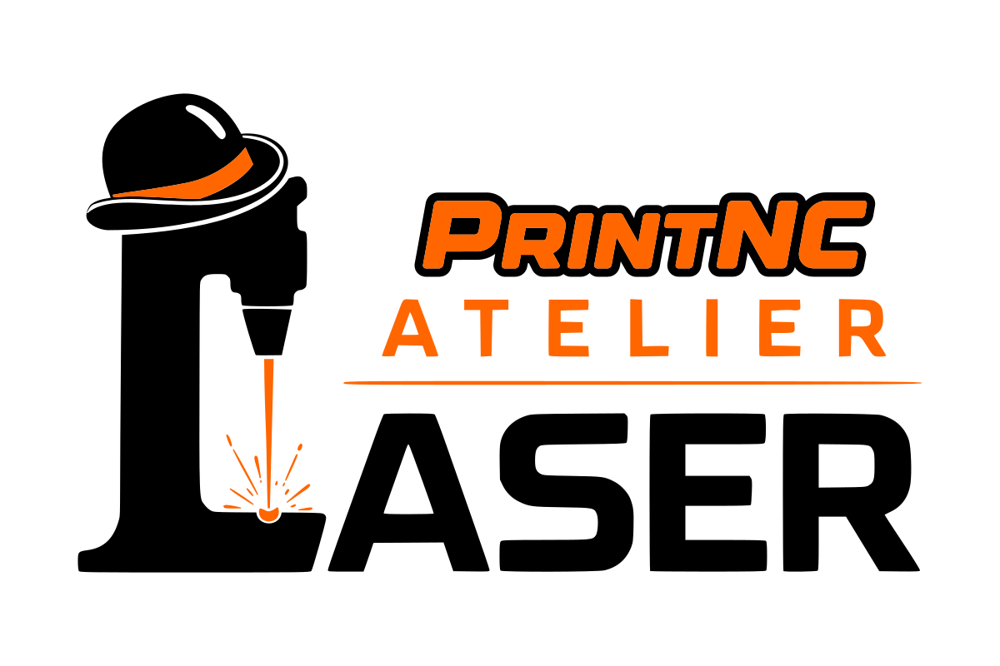
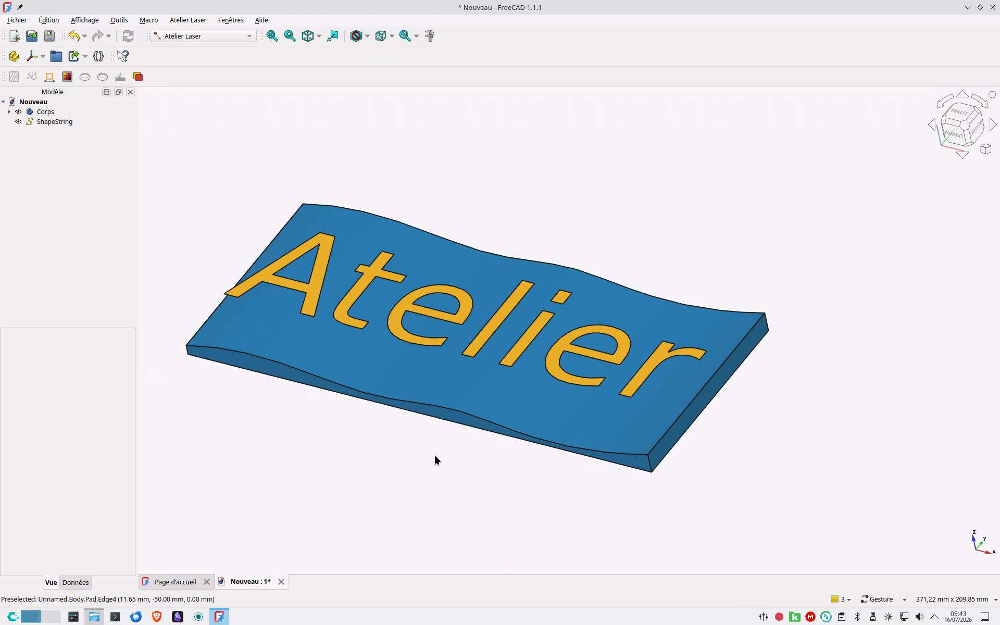
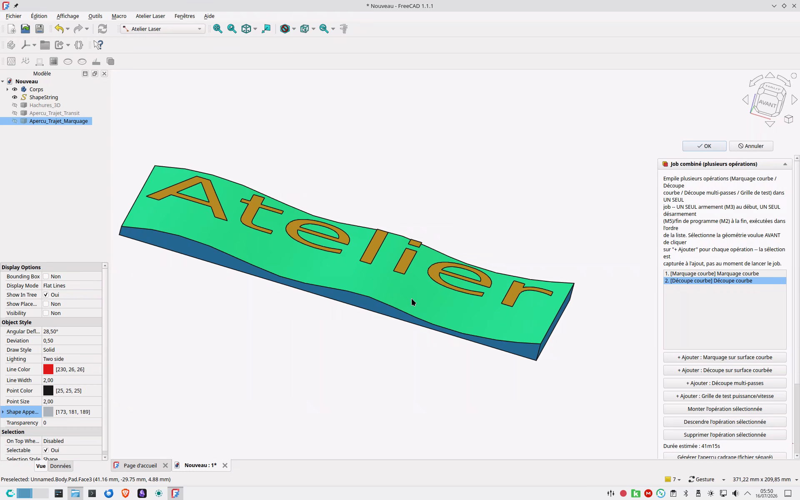
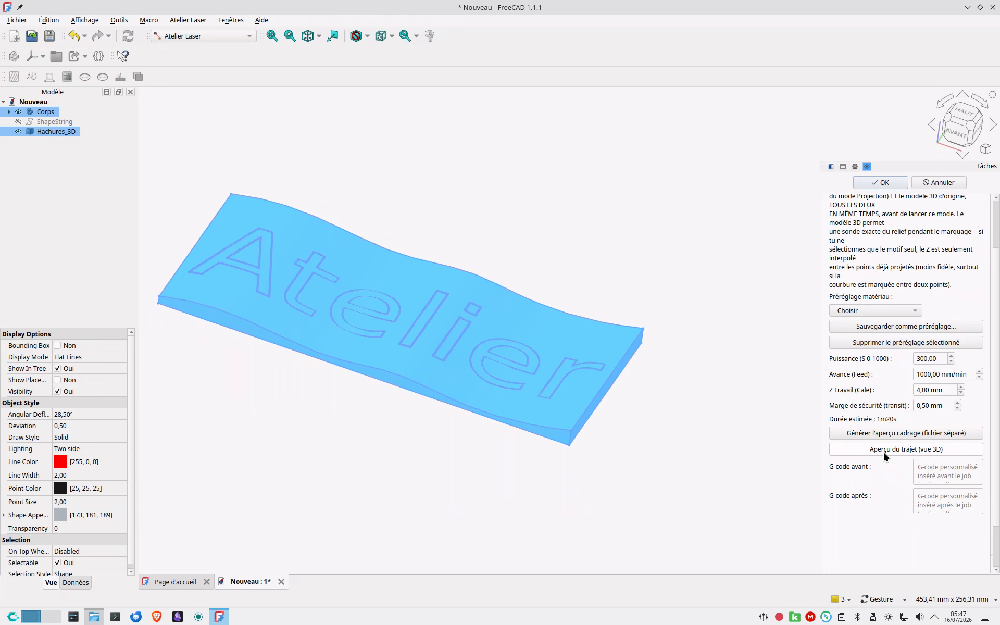
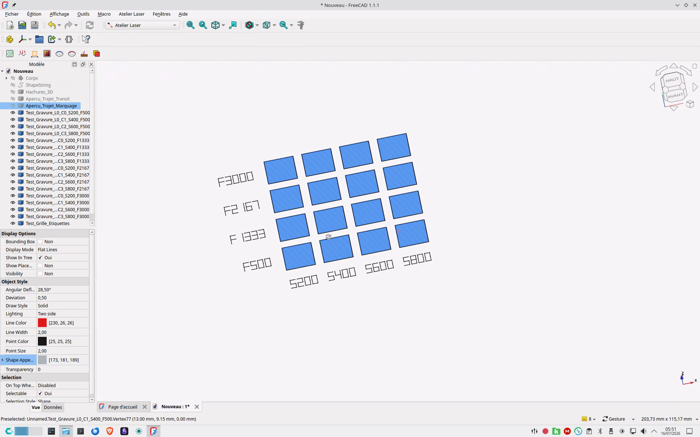

# Atelier Laser

<p align="center"></p>
<p align="center"><br><sub><b>v2.65.0</b> — Le petit chapeau en coin de chaque icône est la signature de l'<a href="https://atelierduverdier.fr">Atelier du Verdier</a>.<br>© Atelier du Verdier — licence <a href="LICENSE">LGPL-2.1-or-later</a>.</sub></p>
<p align="center"><a href="https://ko-fi.com/atelierduverdier"><b>☕ L'atelier vous est utile ? Soutenez-le sur Ko-fi</b></a></p>

Workbench [FreeCAD](https://www.freecad.org/) pour la génération de G-code de marquage/découpe laser : gravure noir plein de textes/formes, suivi de surfaces 3D courbes, découpe multi-passes, grilles de test et de calibration, et jobs combinant plusieurs opérations en une seule passe.

> 📖 **Documentation complète** : une page web autonome présente tout l'atelier (présentation, installation, flux de travail, les 20 modes en images, calibration, préférences, G-code, FAQ) dans [`docs/index.html`](docs/index.html). Elle est prête pour **GitHub Pages** : dans les réglages du dépôt, activer *Pages* → source *Deploy from a branch* → branche `main`, dossier `/docs` ; la doc est alors publiée à l'adresse `https://atelierduverdier.github.io/LaserAtelier/`. Le fichier fonctionne aussi tel quel si on l'ouvre en local ou qu'on copie le dossier `docs/` sur un autre site.

## Fonctionnalités

Les modes sont regroupés par thème dans la barre d'outils et le menu. Le **Guide rapide** (première icône, livre ouvert) résume le flux de travail (calibrer → tester → motif → G-code → cadrage → graver) et « quel mode pour quoi ? » — le point d'entrée pour découvrir l'atelier. **Workflow type** : créer/charger le tracé (SVG, ShapeString, sketch) → le placer en X/Y par rapport au futur zéro pièce → le **projeter** sur la pièce (contrôle visuel : le tracé est posé sur la surface, plate ou 3D) → graver avec **Marquage** (traits, sélectionner le projeté) ou **Gravure remplie** (noir plein, sélectionner la forme fermée *source*). La hauteur Z du document est visuelle : le G-code suppose toujours zéro Z machine sur la surface gravée, et un job = une seule surface de référence. Chaque panneau ouvre sur un résumé court avec un bouton « En savoir plus » (détails repliés) et, pour les concepts clés, un petit schéma explicatif (cône de défocus, axes de la grille, rampe, projection…).

**Import de dessins**
- **Importer un dessin SVG** : lit le `.svg` directement et crée **un objet par tracé d'origine**, sélectionnable séparément — sans le détour par le DXF, qui émiettait un crâne de 23 tracés en **plus de 210 fragments** (plus les `_BlockDefinitions`/`Layer` de la plomberie DXF). La couleur de remplissage de chaque tracé est reportée sur l'objet (`LineColor`) pour les distinguer à l'œil sans rouvrir Inkscape. Parseur autonome (`svg_import.py`), courbes aplaties en segments comme partout ailleurs dans l'atelier. **Hors périmètre, annoncé par un avertissement plutôt que subi en silence** : `<use>`, dégradés, `<clipPath>`/masques, `<image>` matricielles, et les classes CSS d'un bloc `<style>`.

**Gravure à plat**
- **Hachures 2D (géométrie)** : remplissage (parallèles / croisées / défocus) sur une face 2D — crée la géométrie des hachures Option **contour** : le bord de la forme (trous compris) est ajouté à l'objet créé — hachures + contour gravés en une seule opération Marquage.
- **Calligraphie (pleins et déliés)** : grave un texte dans une **vraie police calligraphique** (`.otf`/`.ttf` lue sur ton disque) en **un seul passage**. On extrait le squelette de la lettre et sa largeur locale ; la largeur devient une **hauteur Z** — la tête se lève pour élargir le trait dans les pleins, redescend pour les déliés. Rien n'est rempli ni repassé. Le panneau dit si les pleins demandés tiennent dans ce que le bois sait donner, et propose la taille qui les ferait tenir. «&nbsp;Poser le tracé dans le document&nbsp;» crée le trajet en fil dans l'arbre pour le **placer sur la pièce** ; la génération suit ce placement. *Les polices ne sont pas fournies : celles du commerce sont presque toutes en licence « usage personnel ».*
- **Texte (trait simple)** : grave du texte en **police mono-trait** (Hershey Sans 1-stroke, domaine public) — chaque lettre dessinée d'un seul trait par branche, comme un traceur à plume, au lieu d'un contour rempli. Majuscules, minuscules, chiffres et accents ; hauteur et espacements réglables. Crée un objet fil à graver avec **Marquage** (idéal au gros point / défocus).
- **Gravure remplie (noir)** : grave un texte/forme 2D en **noir plein** — remplissage par hachures en défocus (point élargi, automatiquement **rentré du rayon de point** pour ne pas déborder du bord, avec un liseré qui ferme les blancs le long des bords) **puis** contour repassé net au foyer (épaisseur de trait réglable). Préréglages matériau. **Styles de trait** au choix pour le remplissage et le contour : trait plein, **tirets** (faisceau pulsé, mouvement continu), **pointillé** (vrais points ronds gravés en micro-traits — jamais de pulse G4 faisceau allumé, compatible puissance asservie ; gros points doux en défocus), ou **vague défocus** (le Z oscille entre le foyer et un défocus max : le trait varie continûment en largeur et en intensité, effet calligraphique ; amplitude calculée par la calibration du point, avertissement si la vitesse Z crête dépasse la limite de l'axe). **Remplissage en dégradé** : la puissance varie linéairement le long d'une direction réglable (0° = gauche→droite), de la puissance de remplissage au « S en fin de dégradé » — l'espacement des hachures est resserré sur la brûlure mesurée de la puissance la plus faible pour rester uniforme sur toute la forme.
- **Gravure photo (trame de points)** : convertit une image (PNG/JPG…) en **trame de points laser** — tramage **Diffusion (Floyd-Steinberg)** (points identiques, la densité rend le gris) ou **Durée variable** (chaque point dure proportionnellement à la noirceur locale), parcours en serpentin, option négatif pour matériaux foncés, et **largeur du point** réglable (la hauteur de défocus est calculée via la calibration — gros points doux pour trames larges). Troisième tramage : **Lignes calibrées (nuancier)** — la **photo calibrée** : chaque ligne de l'image est balayée **en continu** (G64, serpentin), la puissance S modulée **pixel par pixel** pour viser la noirceur du pixel via la courbe noirceur→fluence des tons **mesurés** du nuancier ; gris fidèles au matériau réel, et bien plus rapide que les points (pas d'arrêt par pixel). Sous la noirceur minimale mesurée, la fluence est prolongée vers 0 (hautes lumières progressives) ; les pixels qui satureraient S max sont plafonnés et comptés en tête du G-code (ralentir la vitesse si trop nombreux). Quatrième tramage : **Diffusion en lignes (points fins, rapide)** — le rendu points du tramage Diffusion, mais balayé **en continu** : le faisceau s'allume/s'éteint par pixel à puissance fixe le long de chaque ligne (G64, serpentin) — l'esthétique des points à la vitesse d'un balayage, point fin au foyer conseillé. Cinquième tramage : **Gros points Z (taille variable, artistique)** — un point par cellule dont le **diamètre** rend la noirceur (petit point net au foyer pour les clairs, gros point défocalisé pour les foncés), la taille venant de la **hauteur Z** (cône calibré), le Z bougeant **entre** les points ; de près un semis de points, de loin l'image. Sixième tramage : **Similigravure (trame 45°, sans calibration)** — la trame des journaux. Une maille régulière à 45° exacte (arithmétique entière sur le réseau de pixels, donc **aucun moiré**), où c'est le **diamètre du point** qui rend le gris : chaque point brûle à pleine puissance, seule sa *surface* varie, et la couverture obtenue **égale** la noirceur demandée. Grave **au foyer** (le point doit être net, c'est lui le grain) et ne consulte **aucune** courbe de calibration — le gris devient une géométrie au lieu d'être demandé au bois. Septième tramage : **Lignes gravées (trait qui enfle)** — une ligne continue par rangée, faisceau **jamais coupé**, dont l'**épaisseur** rend le gris : fin dans les clairs, épais dans les foncés, comme une taille-douce. La largeur est lue dans la **table des largeurs brûlées** (le kerf mesuré), pas dans le nuancier : aucune calibration requise. **Seuil blanc** (v2.6) : son niveau le plus bas n'est pas « rien » mais la *puissance la plus faible mesurée*, si bien qu'un pixel blanc pur gravait quand même un trait de 0,10 mm — **33 % de couverture au pas 0,30 sur hêtre**, un fond blanc sortant gris uni (constaté sur planche le 31/07/2026, alors que l'en-tête du G-code annonçait « couverture 33 a 100 % » depuis toujours sans que rien ne le consomme). Le champ « Seuil blanc » laisse désormais le bois nu sous une noirceur donnée ; le faisceau s'éteint mais le **mouvement reste continu** (`G1` à la même avance, jamais de `G0`), et le verdict prévient *avant* de graver quand le seuil est à 0. Le mode avait été conçu « jamais de bois nu » en réponse aux 27 % de planche vierge du portrait calibré — mais ces trous-là étaient des **manques dans les demi-teintes**, alors qu'un fond blanc doit rester blanc. **Puissance maxi du trait** (v2.8) : à pleine puissance le trait atteint sa largeur maximale mais il peut **creuser**, la surface ressortant striée — la table des largeurs mesure la largeur, jamais la **profondeur**, elle ne peut donc pas le prévoir (relevé à l'établi le 31/07/2026, en cours de gravure). Le plafond retire des *paliers mesurés*, il n'invente aucune largeur intermédiaire ; sur hêtre F800 au pas 0,30, S950 → 0,29 mm et 62 points de contraste, S900 → 0,28 mm et 58 points, contre 0,30 mm et 67 points sans plafond. **Mais ces points perdus sont en grande partie théoriques**, établi le 31/07/2026 par deux mesures indépendantes : deux portraits **jumeaux** (même fichier, parcours rigoureusement identique, seule la puissance change) gravés à 100 % et à 90 % donnent la même noirceur d'ensemble mais des **noirs profonds plus denses à 90 %** (surface sous 30 % de luminance : 20,4 → 22,6 %) ; et une planche de dix aplats S600–S1000 classée à l'œil place **S925 devant S950, S975 et S1000**. La noirceur **sature vers S900-950** : au-delà on creuse sans noircir. **92 % est le réglage retenu à l'atelier** ; inutile d'affiner plus finement que ~75 S, l'œil ne distingue rien en dessous sur ce bois, et le constat est à revérifier sur un autre matériau ou une autre vitesse. Un plafond sous la plus faible puissance mesurée fait refuser le mode, et le message accuse alors le plafond, pas la vitesse. **Sous le seuil** (v2.7), au choix : **Bois nu** (net et franc — fond blanc, dessin encré, logo) ou **Pointillé dégressif** (le trait le plus fin, mais espacé, de plus en plus clairsemé vers le blanc pur — photographie, dégradé doux). Le pointillé fait ce que la largeur ne peut pas : la table des largeurs s'arrêtant à la puissance la plus basse mesurée, espacer le trait est le **seul moyen** de descendre sous le plancher du mode, et la couverture balaie alors continûment 0 → 33 % au lieu de sauter. Trame **ordonnée** (Bayer 4×4), jamais une diffusion d'erreur : déterministe, elle ne bave pas d'une ligne sur l'autre. Au-dessus du seuil, la noirceur restante est **remise à l'échelle** sur toute la plage de largeurs — sans quoi un seuil à 8 % gâchait les paliers les plus fins (0,116 mm au lieu de 0,10) et laissait 5 points d'écart entre les deux branches ; mesuré après correction : 33,3 % de part et d'autre du seuil. **Défocus du trait** (v2.53) : ce mode ne gravait qu'**au foyer**, au motif que ce qui compte n'est pas la largeur absolue mais le **rapport** fin/épais, plus grand au foyer. La table du hêtre remesurée en août a périmé la règle : au foyer à F800 il ne reste que **1,67×** (0,12→0,20 mm) quand le **défocus 15 à F650 donne 1,73×** avec un trait de 0,67→1,16 mm — donc un pas six fois plus large, six fois moins de rangées, bien moins d'énergie. Un sélecteur propose les hauteurs **réellement mesurées** pour le matériau, et elles seules : entre deux niveaux le modèle interpole, et un niveau qui ne porte qu'une puissance rendrait la même largeur à S200 et à S1000, soit un rapport de 1,00× inexplicable à l'écran. Le prix est le **grain** — 100 rangées sur 120 mm au lieu de 600 — et c'est le but recherché : le rendu quitte la photographie pour la gravure sur bois. Le verdict nomme la hauteur dans sa première phrase : 0,12→0,20 et 0,67→1,16 mm sont le même bois à la même vitesse, et deux gravures sans rapport. **La vitesse avant le pas** : au-delà de F800 le trait cesse d'enfler (F1200 : 1,7× ; F1500 : plat, le mode refuse), et le panneau nomme cette vitesse *avant* de conseiller quoi que ce soit sur le pas. **Fuseau par la hauteur Z** (v2.54, spirale seulement) : la largeur ne vient plus de la puissance — qui donne une valeur par case, donc des marches d'un pas, très visibles au pas 1,16 mm — mais de la **hauteur** : la tête se lève progressivement, le point s'élargit, et le trait devient un fuseau continu du plus fin que le bois sache faire à sa plus large brûlure **mesurée** (sur hêtre : 0,18 → 3,43 mm). La puissance suit la largeur pour garder la teinte (S proportionnel au diamètre), bornée à la plage mesurée et le panneau dit où la borne mord. Le **pas plafonne** le haut du fuseau (v2.55) : au-delà, les tours voisins se recouvrent et le noir devient un aplat repassé. Ça rend du détail, parce que la course du Z tombe avec la largeur maxi — au pas 3,0 mm il faut 41 mm de course et 5,4 mm de trace par fuseau ; au pas 1,0 il ne faut plus que **9 mm de course et 1,2 mm de trace**, pour 120 tours sur 120 mm. **Le prix est le détail** : l'axe Z a une vitesse limite, donc le trait ne peut pas grossir plus vite qu'une certaine pente, et le verdict annonce la longueur mini d'un fuseau avant de graver. **Mettre le seuil blanc à 0** : le seuil coupe le faisceau dans les clairs et hache la spirale en pointillés, alors que le rendu visé ne coupe jamais le trait. Le générateur borne lui-même cette pente : au-delà LinuxCNC ne refuse pas, il *ralentit tout le mouvement* pour que le Z suive, ce qui change le temps de pose donc la noirceur, sans rien dire. Le verdict annonce la longueur mini d'un fuseau avant de graver, et rappelle de vérifier le dégagement au-dessus de la pièce. Ces trois derniers tramages rendent le gris par la **forme** d'une marque visible à l'œil nu : ils réclament de la place, le panneau le dit en dessous de 100 mm de large. Réglages d'image : **Tonalité (gamma)** avec aperçu en direct (photo saturée = gris trop foncés → gamma 1,5-2), et **Mire des tramages** : le même dégradé de gris gravé par chaque tramage, en bandes étiquetées, pour comparer les styles sur chute. Bouton **Photo de démonstration** : charge la photo de test fournie (Guy de Maupassant par Nadar, 1888, domaine public) pour comparer tramages et tonalité avant d'utiliser ses photos. **Préréglages** (★ d'usine + les tiens) : portrait lignes calibrées (qualité), essai rapide points fins (brouillon), photo points fins (équilibré), gros points Z (artistique) — un clic remplit tous les champs, l'image choisie n'est pas touchée. Les points sont gravés en **micro-traits** (jamais de pulse G4 à l'arrêt) : compatible avec une puissance asservie à la vitesse réelle (HAL PrintNC).

**Sur surface 3D**
- **Projection sur surface 3D** : projette un motif 2D sur une surface courbe (sonde par tessellation, quasi instantanée même sur un remplissage dense). Le panneau s'ouvre d'abord, puis on sélectionne les motifs 2D et la surface 3D dans la vue (état reconnu affiché en direct) avant de valider.
- **Marquage de motif (plat ou courbe)** : grave un motif filaire à plat (motif 2D seul) ou en suivant le relief d'un modèle 3D (sonde par tessellation, ou interpolation), avec préréglages matériau, aperçu du trajet directement dans la vue 3D, et **8 styles de trait** (plein / tirets / pointillé / vague défocus / **défocus point élargi** / **dégradé de largeur (sur la pièce)** / **dégradé de largeur (le long du tracé)** / **dégradé de puissance (le long du tracé)** — pour le premier des trois, le défocus varie linéairement le long d'une direction réglable, entre deux largeurs de trait : des hachures qui passent du net/dense au large/doux d'un bord à l'autre de la pièce — ce dernier grave le motif au-dessus du foyer pour noircir un remplissage en un passage, l'équivalent du remplissage Défocus des Hachures 2D appliqué au motif projeté ; tous les styles suivent le relief comme le trait plein). **Mire des styles** : le même trait droit gravé par chacun des 6 styles, en bandes étiquetées 1-6, pour choisir un style sur chute de matériau. **Planche des styles (exemples)** : un même **mot** exemple gravé dans chaque style — dont le **défocus point élargi à plusieurs largeurs** — chaque exemple **numéroté et légendé au foyer** ; on voit le rendu réel sur de vraies lettres (pas un simple trait), à garder comme planche de référence après calibration. **Style « Dégradé de largeur (le long du tracé) » (v2.9)** : la largeur varie du **début à la fin du trait** (deux cases en mm, converties en hauteur de bec par la calibration du point) — à distinguer du « Dégradé de largeur (sur la pièce) », qui rampe selon un angle et suit donc la *position* et non le *parcours* : sur une spirale, seul le premier donne un vrai fuseau extérieur→centre. **Chaque trait sélectionné porte sa rampe entière**, donc le résultat ne dépend pas de l'ordre de parcours (choisi pour le trajet). Sur une **boucle fermée**, au choix : *marche visible* à la fermeture, ou *aller-retour* (largeur de fin atteinte à mi-parcours, boucle refermée sans raccord) ; l'option est ignorée sur un trait ouvert. Borne basse à connaître : le point au foyer fait 0,30 mm, on ne descend pas sous cette largeur optique. **Style « Dégradé de puissance (le long du tracé) » (v2.12)** : le troisième dégradé, et il fait l'inverse des deux autres — le bec **ne bouge pas** (Z constant, point optique constant — le trait brûlé s'épaissit tout de même avec S, 0,10 → 0,30 mm sur hêtre au foyer à F800, car à basse puissance seul le cœur du faisceau dépasse le seuil de brûlure ; c'est donc **d'abord** un dégradé de teinte, l'élargissement restant 4× moindre que celui d'un fuseau) et c'est la **puissance** qui rampe le long du parcours, entre deux cases en S. C'est le vrai dégradé de *teinte* : clair au départ, foncé à l'arrivée. Il partage l'option *aller-retour* des boucles fermées, et avec `M67` (commande de puissance synchronisée sur le mouvement) les changements de puissance ne coûtent aucun arrêt. **Rampe de puissance sur les dégradés de largeur (v2.13)** : une case « faire varier aussi la puissance » superpose une rampe de S aux deux dégradés de largeur — sans elle S reste constant pendant que la largeur varie, donc la fluence évolue en 1/largeur (spirale gravée à S1000 de 0,3 à 4 mm : marbrée au bout large, carbonisée au bout fin). Un bouton **« Compenser la fluence »** calcule la puissance de fin qui donnerait la même teinte qu'au début (S proportionnel à la largeur, même modèle que le style vague) et **avertit quand elle tombe sous la plus basse puissance mesurée** sur le matériau — sur un rapport de largeurs de 13× la teinte uniforme n'est pas atteignable, il faut resserrer l'écart ou accepter que la teinte varie.
- **Découpe multi-passes sur surface courbée** : combine le suivi de relief du marquage courbe avec la logique multi-passes/kerf/imbrication de la découpe à plat.

**Découpe**
- **Découpe multi-passes (matériau plat)** : passes progressives, compensation de kerf, ordre trous-avant-contour, rampe de puissance, dernière passe ralentie. **Attaches (tabs)** : ponts de matière non coupés (nombre/longueur/hauteur réglables) qui retiennent la pièce — et la chute des trous — jusqu'à la fin du job, seules les passes profondes les sautent. **Amorce (lead-in)** : le faisceau s'allume dans la chute (extérieur d'une pièce, intérieur d'un trou) puis rejoint le contour — la verrue d'allumage reste hors du bord fini. **Copies en matrice** : réplique la sélection en n×m au pas choisi pour découper une série en un seul job. Les tracés **ouverts** sont coupés en aller-retour (sens alterné à chaque passe).

**Tests & calibration**
- **Calibration kerf** : deux géométries de test à découper ensuite. Le **carré** sert à *mesurer* le kerf (kerf = taille dessinée − taille mesurée au pied à coulisse). Le **tenon + mortaise** sert à *valider l'ajustement* une fois le kerf connu : un tenon (pièce mâle) et une rangée de mortaises au même nominal mais à jeu croissant — on découpe avec la compensation de kerf trouvée, on insère le tenon dans chaque mortaise et on retient le jeu qui donne le bon ajustement (serré pour un collage, glissant pour du démontable). Le mode crée **deux objets** : **« découpe »** (les contours seuls) et **« gravure »** (le jeu sous chaque mortaise + la cote sur le tenon de référence). Le texte est ainsi *marqué à faible puissance* — opération distincte de la découpe — au lieu d'être coupé : on grave puis on découpe (ou on enchaîne via Job combiné).
- **Grille de test puissance/vitesse** : job unique en grille de cellules à puissance/vitesse variables, avec étiquettes de repérage, **cadre net au foyer** autour de chaque cellule, optimisation du trajet par proximité, remplissage défocus et préréglages matériau. Un menu **Objectif** remplit toute la grille selon la *donnée cherchée* — quatre recettes, et ce ne sont pas quatre variantes du même essai : **Nuancier — tons clairs (défocus)** (16 aplats de S200/F4000 ≈ 5 % à S600/F1000 ≈ 74 %, pour compléter le **bas** du nuancier, celui qui manque presque toujours) ; **Largeurs brûlées — grille en défocus** (traits **isolés et horizontaux** à 15 mm, en vitesses **lentes** : défocalisé, un trait isolé cesse de marquer bien avant les vitesses des tons clairs — à n'employer qu'à un défocus *autre* que 15 ou 36, la Planche 2 couvrant ceux-là avec un cadrage automatique) ; **Noirceur — bande en balayage (photo calibrée)** (des **aplats**, une seule vitesse, le pas d'une vraie photo — c'est elle qui alimente la courbe noirceur → énergie, donc la photo calibrée et le « ton sur mesure » ; puissances **volontairement mélangées**, parce que rangées par ordre croissant les cases se jugent les unes par rapport aux autres et l'œil fabrique une progression qui n'existe pas) ; **Découpe — trouver le passage** (contours seuls, on cherche la case qui traverse proprement en une passe). Chaque objectif affiche sa **note** : quoi mesurer, où le reporter, et le piège propre à cette planche ; les valeurs restent modifiables ensuite. Le report des tons se fait **sur place**, dans le bloc « Noirceur jugée à l'œil » au bas de la section ② — plus d'aller-retour vers le Nuancier avec les valeurs retenues de mémoire. Le **défocus des cellules est libre** : la saisie ② ouvre une grille pour la hauteur demandée même si ce niveau n'a jamais été mesuré, plus une par niveau déjà connu du matériau — mais un niveau ne compte comme ancrage d'interpolation que s'il porte **au moins deux puissances** (une mesure unique donnerait la même largeur à S200 et à S1000, aplatissant tout l'intervalle qu'elle borne). Enfin, « Enregistrer les mesures » **fusionne** au lieu de remplacer : il reconstruisait la table à partir des seules grilles affichées, et un clic aurait supprimé 27 des 54 mesures en défocus du hêtre de l'atelier. Champ **Hauteur (Z) de test** : par défaut la focale des Préférences, modifiable pour rejouer la même matrice puissance/vitesse à une autre hauteur (bec défocalisé) — on balaie plusieurs hauteurs proprement, une grille par hauteur. **Style de trait** du remplissage (plein / tirets / pointillé) pour comparer un style à travers la matrice (vague/dégradé sont des effets de défocus, à tester dans Marquage).
- **Catalogue (planche de référence)** : grave en **un seul job** une planche de référence — les **6 styles de trait du Marquage** (sur un mot exemple) + un exemple de **Gravure remplie**, chaque bloc titré, avec **aperçu photo** (rendu réaliste, chaque style bien distinct). À graver sur une chute une fois les réglages calés : on voit le rendu réel de chaque style sur son matériau. La gravure photo se teste dans son propre mode (Gravure photo).
- **Test rampe puissance/vitesse (lignes)** : grave de longues lignes, **une par vitesse**, chacune parcourue avec une puissance qui **monte progressivement** de gauche (min) à droite (max). On lit d'un coup, à chaque vitesse, à partir de quelle puissance le trait commence à marquer et où il sature — le complément **continu** de la grille de cellules discrètes. Option **rampe de hauteur (Z)** : la hauteur du bec monte *aussi* le long de chaque ligne, de la focale (gauche) à une hauteur de fin (droite), en même temps que la puissance — pour tester à chaque vitesse l'effet combiné puissance croissante + défocus croissant. Étiquettes vitesse (F) à gauche, et **règle de graduation de puissance** sous la première ligne : traits verticaux à des valeurs de S rondes (bornes + paliers intermédiaires), valeurs écrites en **chiffres verticaux** (empilés) pour tenir dans l'espacement serré — on lit d'un coup la puissance sous n'importe quel point du trait.
- **Bande de calibration défocus** : grave une rangée de courts traits à hauteurs de bec croissantes, étiquetés en **hauteur** (à gauche) et en **puissance** (à droite), avec **rampe de puissance** optionnelle — pour mesurer le foyer (trait le plus fin) et la divergence du point, et renseigner la calibration défocus une bonne fois. Option **plusieurs bandes** : grave N bandes côte à côte (espacées de 5 mm par défaut), une par **vitesse** (de la première à la dernière, interpolées), chacune étiquetée de sa vitesse — tous les niveaux de gris/noir en un seul job, sans relancer une bande par vitesse.
- **Test des offsets X/Y du laser** : job **mixte fraise + laser** qui fraise une croix centrée sur X0 Y0 puis grave une croix laser au même X0 Y0 programmé — l'écart mesuré entre les deux croix donne directement la correction des offsets X/Y de l'outil laser dans `tool.tbl` (X_nouveau = X_actuel − dX, idem Y). Seul mode de l'atelier à faire ses propres changements d'outil (`T<fraise> M6` puis `T<laser> M6`, glissière laser montée pendant la pause du second) ; les autres modes supposent le `T<laser> M6` déjà fait.

**Assemblage**
- **Job combiné** : assemble plusieurs opérations dans un seul fichier G-code avec un seul armement du laser, transition de sécurité anti-collision entre opérations. On **ajoute chaque opération depuis son vrai mode** : tu ouvres le mode normal (Découpe, Marquage, Gravure remplie, Grille de test…), tu règles tout avec **toutes ses options** (attaches, amorce, copies, styles de trait, compensation de kerf…), puis tu cliques **« ➕ Ajouter au job combiné »** ; le mode Job combiné ne fait plus qu'ordonner la liste et générer le fichier. Pas de fenêtre simplifiée à part — c'est la même fenêtre que d'habitude, donc aucune perte de fonctionnalité.

**Nuancier matériau** : la palette de gris **mesurée** d'un matériau — chaque ton = un réglage (puissance, vitesse, défocus) + son résultat constaté sur chute (noirceur 0-100 % à l'œil, largeur du trait). On l'alimente après les grilles/rampes de test (mode Nuancier, dans Tests & calibration), et dans les modes **Marquage** et **Gravure remplie**, choisir un ton du nuancier l'applique aussitôt : puissance/vitesse (et style Défocus à la largeur mesurée, le cas échéant) réglés sur un rendu déjà validé. La noirceur n'étant pas linéaire avec la puissance, le logiciel s'appuie sur ces mesures (ton le plus proche) plutôt que sur un modèle — fondation des futurs dégradés calibrés et photos calibrées. Le Marquage propose en plus un **ton sur mesure interpolé** : on choisit la **largeur de trait** (→ défocus via la calibration du point) et la **noirceur visée** (→ vitesse, interpolée sur la courbe noirceur→fluence construite à partir des tons **mesurés** en défocus, lissée par régression isotone car la noirceur sature avec l'énergie ; bornée aux noirceurs mesurées, jamais extrapolée) — un clic règle style Défocus + largeur + vitesse, à valider sur une chute.

Les cinq modes qui travaillent sur une **sélection** (Hachures, Gravure remplie, Marquage, Découpe plate et Découpe courbe) portent un bouton **« Reprendre la sélection de la vue »** : un panneau ne capture la sélection qu'à son *ouverture*, ce bouton la relit. Depuis la v2.10 une ligne d'état l'accompagne — grise « identique à celle du panneau » (bouton inactif), rouge « *N* objets — différente » dès que la vue 3D montre autre chose, et le bouton s'active. **Les réglages en cours ne sont jamais remplacés**, seule la géométrie change : c'est pourquoi la reprise reste un bouton et non un automatisme, une reprise automatique rechargeant aussi la recette attachée à la forme et écrasant en silence ce qu'on vient de saisir.

Tous les modes de **test & calibration** (Grille, Rampe, Bande de calibration défocus, Kerf, Offsets) ont un sélecteur de **préréglages** : des **préréglages d'usine** (★, points de départ prêts à l'emploi, non supprimables) qu'on charge d'un clic, plus les siens (sauvegarde/suppression comme les préréglages matériau des autres modes).

Communs à tous les modes : estimation de durée **tenant compte des accélérations** (profil trapézoïdal par course, accélération réglable dans les Préférences — décisif sur les remplissages faits de milliers de traits courts), aperçu de trajet dans la vue 3D, aperçu de cadrage en fichier séparé (avec faisceau de visée à très faible puissance optionnel) pour vérifier le positionnement avant de lancer, préréglages matériau, préférences globales, et **mémorisation des derniers réglages** de chaque panneau (rouvrir un mode retrouve les valeurs de la dernière fois). Mieux : les **réglages sont attachés à la forme** — à la génération, les réglages du panneau sont écrits dans une propriété de l'objet sélectionné, sauvegardée **avec le document** (.FCStd). Rouvrir plus tard le même mode avec cette forme sélectionnée re-propose *ses* réglages (prioritaires sur les derniers réglages globaux) : chaque forme du document garde sa recette de gravure. Et chaque génération crée un objet **Job** dans l'arborescence (« Job Marquage - Logo »…) qui référence la ou les formes sources : **double-clic dessus** = re-sélection des sources et réouverture du panneau pré-rempli, prêt à modifier et régénérer. Un Job par couple mode/forme — et même **par sous-sélection** : deux faces d'un même sketch ou d'un SVG importé peuvent porter deux recettes et deux Jobs distincts (« Job Gravure remplie - Sketch [Face2] »), sans rien séparer à la main. Régénérer met à jour le Job existant, votre renommage est conservé. Jobs et formes sources sont rangés automatiquement dans un dossier **« Atelier Laser »** de l'arborescence, et un bouton dédié empile les **Jobs sélectionnés dans le job combiné** (chacun avec sa recette) pour générer un fichier unique sans rouvrir les panneaux.

## La hiérarchie des tests (nouveau matériau = trois planches)

Chaque test alimente le suivant — dans l'ordre :

1. **Une fois par laser** (pas par matériau) : **Bande de calibration défocus** (deux mesures du point → Préférences), puis **Test offsets fraise + laser** (X/Y du laser dans `tool.tbl`).
2. **Nouveau matériau** : trois boutons **« Planche 1 / 2 / 3 »** (panneau Grille de test, ou l'**Assistant matériau** qui regroupe planches, saisie et déductions dans un seul panneau) → trois G-codes séparés, chacun recadré au zéro pièce (coin bas-gauche, sur le dessus) :
   - **Tout depuis le panneau (v2.16)** : le bouton **« Redresser une photo de planche… »**, sous les boutons Planche 1/2/3, enchaîne le tout — choix de plusieurs photos (gros plans compris), confirmation des cotes de la mire (pré-remplies depuis le générateur courant, **corrigeables** en lisant les cotes gravées sur le bois), fenêtre OpenCV pour cliquer les 4 croix, rangement dans les *photos du résultat* avec date et échelle en description, et **pose de l'image dans le document à sa taille exacte en mm**. **Garde-fou (v2.25.0)** : si les cotes saisies sont celles d'une *autre* planche connue, l'atelier le signale et propose de corriger le rangement — les cotes viennent du bois, le choix de la planche vient de la mémoire, et c'est la mémoire qui a tort. **Galerie (v2.20.0)** : une liste « Photos de : Planche 1 / 2 / autre » + vignette cliquable est placée sous le bouton — elle manquait, le message promettait « rangée dans les photos du résultat » et *rien* ne les affichait (il fallait ouvrir le dossier). Les clés de rangement sont maintenant une **source unique** partagée par le bouton qui écrit et la galerie qui lit. La galerie garde un **aperçu JPEG de ~0,5 Mo**, pas le PNG de mesure de 55 Mo (290 Mo accumulés en une matinée avant qu'on le remarque) ; le fichier de mesure reste à sa place et son chemin part dans la description. **Reposer (v2.21.0)** : le bouton « Reposer une planche déjà redressée… » remet l'image dans le document à son échelle exacte **sans recliquer les quatre croix** — rouvrir FreeCAD sans avoir enregistré le document ne doit pas coûter tout le redressement. La taille en mm vient d'une **fiche `.json` écrite systématiquement à côté de l'image** (même raisonnement que les cotes gravées sur la planche : le fichier porte ce qu'il faut pour être relu) ; sans fiche, elle est déduite des pixels et de l'échelle demandée. Les **mesures**, elles, vivent dans la configuration et pas dans le document : rouvrir le panneau et choisir le matériau les recharge.
   - **Un dossier à part, et le laser dans le nom (v2.22.0)** : les planches redressées vont dans un **dossier dédié** réglable en Préférences (`planches_dir`, défaut `~/Planches-LaserAtelier`) — pas à côté de la photo d'origine, où elles se perdaient au milieu des `IMG_*.JPG`. Le nom porte le **laser actif** : `LT-80W-AA-PRO_planche1_20260801-0745_redresse.png`, répété dans la fiche `.json`. Ce n'est pas de l'étiquetage : une largeur brûlée **n'a de sens que pour le module qui l'a gravée** — deux diodes donnent deux tables — et à l'inverse, quelqu'un possédant le *même* module peut reprendre ces mesures telles quelles sans refaire une heure d'établi. **Et il est GRAVÉ sur la planche (v2.24.0)**, à côté des cotes, sous la réglette (`140-60  LT-80W-AA-PRO`) — en police mono-trait, la 7 segments ne sachant écrire ni L ni T ni W ; la **Planche 3**, qui n’a pas de mire, le grave sur une rangée à part au-dessus de sa bande (v2.24.1) ; un nom trop long rétrécit plutôt que de déborder sur le repère en croix. Le nom de fichier ne suit pas le bois, et c'est le bois qui survit. Le nom vient du **profil laser actif** : renommez-le avec la référence de votre module et tout suit. Le champ de renommage est large et le rappelle (v2.23.0) — une case de quinze caractères invitait à taper « Bleu » là où il faut une référence de matériel.
   - **Gérer / supprimer des planches (v2.23.0)** : regraver une planche mieux réussie est le cas *normal*. Le bouton liste celles du dossier avec leur laser, leurs cotes, leur poids et **l'écart mesuré sur la réglette** — le bon critère pour choisir laquelle garder, puisque c'est la seule mesure indépendante des croix cliquées. Sélection multiple, confirmation nommant les fichiers, puis suppression de **l'ensemble** : image de mesure, fiche, aperçu, contrôle des repères et vignette de la galerie. « Supprimer la photo affichée » n'enlevait que l'aperçu et laissait les 55 Mo sur le disque — une suppression qui n'efface que ce qui se voit est un demi-mensonge. Le redressement tourne avec le python **système** (OpenCV absent de l'AppImage FreeCAD), sous-traité par `subprocess` — zéro dépendance ajoutée au workbench. Et pour mesurer sans quitter la saisie : **« Mesurer A → B dans la vue 3D »** est placé *dans* le bloc ② — on clique la case à remplir, puis le bouton, puis deux points, et la distance atterrit dans la case (le panneau des tâches de FreeCAD étant exclusif, l'outil Ligne du Draft obligeait sinon à fermer la grille). **Moyenne (v2.18.0)** : les bords d'une brûlure ondulent — c'est le grain qui décide —, donc des mesures successives sur la *même* case sont cumulées, la case reçoit la **moyenne courante** et le panneau affiche l'**étendue** entre les mesures (elle dit si le critère « où s'arrête la brûlure » a tenu d'un bout à l'autre) ; re-cliquer la case repart de zéro. La cible est **nommée à l'écran** avant qu'on pointe — une valeur tombée dans la mauvaise case ne se voit pas, elle ressemble à une mesure. **v2.19.0** : un bouton **sous chaque grille** (plus de défilement entre chaque valeur), et une case « **mesurer en travers du trait** » cochée par défaut, qui ne retient que la composante perpendiculaire (la plus grande de dx et dy) — la distance directe vaut `hypot(dx, dy)`, donc elle est *toujours* trop grande dès que les clics sont décalés latéralement : 0,36 mm annoncés pour un trait de 0,30 avec 0,20 de décalage, soit 20 % de trop sans le moindre signal. *Défaut corrigé au premier usage réel* : la case était lue **après** que le bouton ait pris le focus, donc jamais — le panneau réclamait un geste qui venait d'être fait.
   - **Mesurer sur photo** : `outils/redresser_photo.py` (python système + OpenCV, **hors** du workbench — cv2 n'existe pas dans le python de FreeCAD) redresse la photo d'une planche à partir des quatre croix de la mire et la sort à une échelle **exacte et choisie** (ex. 50 px/mm). On l'importe dans FreeCAD à la taille annoncée et on mesure à l'outil **Ligne** du Draft : c'est l'utilisateur qui décide où s'arrête la brûlure, ce qu'aucun seuil automatique ne sait faire à sa place. Indispensable parce que FreeCAD met une image à l'échelle de façon *uniforme* : il ne corrige pas une perspective, et une photo de biais fausse tout sans le dire. Mesuré le 31/07/2026 : perspective ramenée de 1 % à **0,05 %**, intervalles de 10 mm à 499,8 px pour 500 attendus. Le script remet les quatre points en ordre lui-même et refuse un quadrilatère croisé — dans le mauvais ordre ils produisaient une image détruite accompagnée de chiffres plausibles.
   - **La planche se vérifie elle-même (v2.17.0)** : après redressement, l'outil **mesure le pas de la réglette gravée** et le compare à l'échelle annoncée. Cette mesure n'entre pas dans le calcul de l'homographie, donc elle est **indépendante des quatre croix** — c'est la première qui contrôle vraiment le résultat. Au-delà de 1,5 % d'écart, *aucun fichier n'est écrit*, et le verdict part dans la description de la photo du résultat. Né d'un défaut du 01/08/2026 : `256-86` (la taille de l'**image** redressée) saisi à la place de `240-70` (les cotes de la **mire**) → image 6 % trop large, **23 % trop haute**, un trait de 0,30 mm lu 0,37 — et les deux contrôles existants (écart des diagonales 0,03 %, rapport des cotes) passaient tous les deux, parce qu'ils se calculent sur *les mêmes quatre points que le redressement*. Un contrôle qui relit ses propres données ne contrôle rien.
   - **Mire de mesure gravée (v2.14)** : les Planches 1 et 2 portent une **réglette graduée au millimètre** et **quatre repères en croix** aux coins d'un rectangle aux cotes rondes, annoncées dans l'en-tête du G-code — il suffit de photographier la planche pour en mesurer les traits. Gravée plutôt que posée : une réglette d'acier est 0,5 à 1 mm au-dessus de la surface, donc vue sous un autre angle en macro (parallaxe), alors qu'une graduation gravée partage le plan **et le repère machine**. Quatre repères et non un seul, pour corriger la **perspective** et pas seulement l'échelle. Gravée **lentement** (`mire_power` S100 / `mire_feed` F300, réglables par laser) : la réglette enchaîne des dizaines d'accélérations, et à F1200 les repères sortaient ondulés — pour un repère, droit prime sur fin. C'est elle qui a révélé le 31/07/2026 qu'un trait annoncé à 0,30 mm en faisait **0,50**, confirmé ensuite au pied à coulisse : la table des largeurs au foyer décrivait un état de la machine qui n'existait plus.
   - **Mesure sur photo, de bout en bout (v2.30 → v2.45)** : la planche photographiée se **redresse** par homographie (4 croix cliquées, échelle **vérifiée indépendamment** par la réglette gravée — au-delà de 1,5 % d'écart, refus net, aucun fichier écrit) ; les planches redressées sont rangées dans un dossier dédié (`~/Planches-LaserAtelier`), **nommées** (laser, planche, date, et un **nom saisi** libre pour les identifier sans ouvrir la photo) et la mire grave désormais le **régime** (`FOYER` ou `DEFOCUS 15.34 PT1.18`) à côté du nom du laser — le fichier ne suit pas le bois, c'est le bois qui survit. La **largeur des traits** se mesure à la ligne : deux lignes horizontales posées sur le profil **moyenné** du trait (l'incertitude est divisée par ~7 par rapport à une lecture colonne), cases enchaînées sans fermer la fenêtre, **cadrage automatique** sur les planches 1, 2 et 2b (la mise en page est rejouée depuis le code qui l'a gravée — on ne fait plus que *valider*), bouton « **Pas de valeur** » pour une case illisible (distincte d'un trait **vierge**, qui est une mesure : saisir 0). La **noirceur** se lit d'un coup sur toute une grille de tons : fiche de grille déposée à côté du G-code (position de chaque case **dans le repère de la mire**, défocus et pas compris), deux repères **bois nu / noir max** proposés puis déplaçables à la souris (le pourcentage est **relatif**, insensible à l'éclairage), **plancher de bruit mesuré sur le grain** (les écarts entre cases : une case sous ce bruit n'est pas un ton clair, elle est vide), clic sur une case pour l'**écarter** (réversible), et versement au nuancier **avec le régime**. Éprouvé sur planche réelle : 36 cases lues, monotones dans les deux sens, et les 10 cases rejetées par le plancher sont exactement celles vues vides sur le bois. Depuis la v2.45, le chemin inverse existe aussi : graver la planche nuancier dépose une **fiche de disposition** (quel ton occupe quel cercle), et le bouton « **Cliquer un ton sur la photo…** » applique un réglage en cliquant son cercle **sur la photo réelle** — calage par les 4 coins du cadre (mémorisé par photo), appariement par **réglages** jamais par rang, et avertissement si le ton a été supprimé du nuancier depuis la gravure. La planche elle-même peut se graver **par bande de noirceur** (très clairs → foncés) pour tester une tranche sur une petite chute, et les balayages photo traversent désormais le **fond blanc en vitesse rapide** (portrait réel : 1 h 57 → 1 h 15, géométrie gravée identique).
   - **Planche 1 — Foyer (S × F)** : grille de traits au foyer (puissances jusqu'à `s_max` × vitesses jusqu'au maxi machine) : mesurer la **largeur brûlée** de chaque trait, noter ceux qui restent vierges (un trait vierge est une donnée : c'est le seuil du matériau) ;
   - **Planche 2 — Défocus (S × F)** : une grille par niveau de défocus, en **balayant la vitesse** (jusqu'à ~F2000). Les niveaux sont **libres** depuis la v2.2 (historiquement 15 et 36 mm) : la saisie ② ouvre une grille pour la hauteur demandée même jamais mesurée, plus une par niveau déjà connu — mais un niveau ne sert d'ancrage d'interpolation que s'il porte **au moins deux puissances** : mesurer les largeurs → le modèle de largeur au défocus devient sensible au feed ;
   - **Planche 3 — Largeur du point** : la bande de calibration du point (Ø au foyer + Ø à une hauteur connue), gravée avec des valeurs par défaut — les réglages fins restent dans le mode « Bande de calibration défocus ».

   Les largeurs des planches 1–2 se saisissent dans la section **« ② Entrer les mesures »** du panneau Grille de test (une grille de saisie par planche/niveau, verrouillée par défaut contre les modifications accidentelles) : elles alimentent l'interpolation largeur(S, F) utilisée par le bouton « Auto (½ point) » des Hachures, et la **Gravure remplie** (style plein) resserre automatiquement l'espacement de ses hachures à la largeur réellement brûlée quand elle est plus étroite que le point optique — c'est ce qui supprime les lignes visibles sur les tons clairs (faibles puissances). Les **noirceurs** (tons) se découvrent avec la **Rampe** ou la **Grille de test** et se consignent **sur place**, dans le bloc « Noirceur jugée à l'œil » au bas de la même section ② (v2.5) — plus d'aller-retour vers le mode **Nuancier** avec les valeurs retenues de mémoire ; ce mode reste l'endroit pour tout revoir et corriger. Toutes ces données restent dans la config locale (`laser_atelier_config.json`, dossier utilisateur FreeCAD) — rien de spécifique à votre machine ne part avec l'atelier.
3. **Après le nuancier** (facultatif, pour choisir à l'œil) : **Mire des styles** (Marquage) et **Mire des tramages** (Gravure photo).

## Modèle de défocus (remplissage noir)

Pour noircir une surface en un seul passage, le remplissage éloigne le bec du foyer : le point s'élargit et des hachures espacées se recouvrent. Le modèle est un cône de divergence linéaire calibré à partir de **deux mesures réelles** du point (au foyer, puis à un défocus connu) — jamais deviné. La **Bande de calibration défocus** fournit ces mesures ; on les saisit **une seule fois dans la section « ② Entrer les mesures »** de son panneau (« point au foyer », « défocus de test », « point au défocus de test ») et tous les modes concernés (Hachures 2D, Gravure remplie, Grille de test, style Vague) les réutilisent : l'atelier calcule le défocus nécessaire pour un espacement donné (et rentre le remplissage du rayon de point pour rester dans le contour).

### Puissance vs défocus (fluence)

Défocaliser étale la **même** puissance sur un point plus large : l'énergie déposée par unité de surface (la **fluence**) baisse, et sous un seuil le trait ne marque plus. Pour un trait balayé à la vitesse `v`, avec un point de diamètre `d` et une puissance `P`, la fluence vaut `F ∝ P / (d · v)` (l'aire du point grossit en `d²`, mais le temps de séjour sur chaque point grossit en `d`, d'où le `1/d` net). Les modes **Gravure remplie** et **Marquage (style Défocus)** exposent une section « Puissance vs défocus » : on renseigne un réglage de **référence** connu bon sur le matériau (puissance, vitesse, et **largeur de point** d'une gravure réussie), et l'atelier soit **indique** la fluence obtenue par rapport à cette référence (à ajuster à la main), soit **compense la puissance automatiquement** pour retrouver la même fluence à la largeur de point et à la vitesse courantes (case à cocher). Dans le mode Marquage, on saisit d'ailleurs directement la **largeur du point** voulue (l'atelier en déduit la hauteur de défocus via la calibration), plus intuitif que de régler une remontée de bec. Aucune constante optique absolue n'est supposée — seuls des rapports à un point mesuré, dans l'esprit « on mesure, on ne devine pas » du reste de l'atelier.

## Démo vidéo

[Vidéo de démonstration sur YouTube](https://youtu.be/KP4F4Cd287A)

## Captures d'écran

Chaque panneau de l'atelier est présenté (capture complète) dans la **[galerie des panneaux](docs/panneaux.md)**.

| | |
|---|---|
|  |  |
|  |  |

## Performances

La sonde de hauteur Z (suivi de relief pour le marquage/découpe sur surface courbe et la projection de motifs) utilisait à l'origine une intersection géométrique OpenCascade **par point sondé** (~5 ms chacune) : sur un remplissage dense, cela représentait des dizaines de milliers d'intersections et plusieurs minutes de calcul. Elle repose maintenant sur une **tessellation unique** de la surface suivie d'une interpolation barycentrique par point (quelques microsecondes).

Concrètement :

- **Tessellation unique** : la surface 3D est convertie une seule fois, au début du calcul, en un maillage de petits triangles (comme les facettes d'un modèle pour l'impression 3D). C'est OpenCascade qui s'en charge, en C++, en quelques millisecondes. Les triangles sont ensuite rangés dans une grille XY pour retrouver instantanément ceux qui se trouvent sous un point donné.
- **Interpolation barycentrique par point** : pour connaître la hauteur Z de la surface sous une position (X, Y), il suffit alors de trouver le triangle qui contient ce point (vu de dessus) et de calculer le Z par une moyenne pondérée des hauteurs de ses trois sommets (les "coordonnées barycentriques" : le poids de chaque sommet dépend de la proximité du point à celui-ci). C'est une poignée de multiplications et d'additions — d'où les quelques microsecondes, là où l'ancienne méthode reconstruisait une intersection géométrique complète ligne/solide à chaque point.

L'astuce est donc de payer une fois un petit coût de préparation (le maillage) pour rendre ensuite chaque requête quasi gratuite, au lieu de payer le prix fort à chacune des dizaines de milliers de requêtes.

Mesures sur une plaque ondulée 100×60 mm, hachures espacées de 0,5 mm (~48 000 points de trajectoire) :

| Calcul | Avant | Après | Gain |
|---|---:|---:|---:|
| Projection du motif sur la surface 3D | 66,2 s | 0,06 s | ×1200 |
| G-code marquage courbe (1er calcul) | 107,0 s | 0,18 s | ×600 |
| G-code marquage courbe (recalcul) | 11,8 s | 0,18 s | ×65 |

Les hachures 2D bénéficient de la même approche (clipping paramétrique de chaque ligne sur la tessellation des faces, au lieu d'une opération booléenne par ligne et par face) :

| Calcul | Avant | Après | Gain |
|---|---:|---:|---:|
| Hachures 0,2 mm sur 24 faces à trou | 2,6 s | 0,08 s | ×33 |
| Grille de test 6×6, hachures 0,2 mm | 1,1 s | 0,06 s | ×17 |

La précision est préservée : l'écart Z entre le maillage et la vraie surface est borné à 0,05 mm (constante `MESH_PROBE_DEVIATION_MM`), validé contre l'ancien raycast exact sur 300 points aléatoires (erreur max mesurée : 0,046 mm) — négligeable face à la tolérance de focus du laser (~0,1 mm).

## Matériel testé

Cet atelier a été développé et testé avec le module laser **LT-80W-AA-PRO** (diode 10 W optiques). Les préréglages de hauteur de bec par épaisseur (`FOCUS_TABLE` dans `laser_core.py`) proviennent du tableau constructeur de ce module.

**Modification matérielle importante** : la pièce carrée qui entoure le nez du laser a été **retirée**, afin de pouvoir suivre les surfaces courbes sans collision. Le contrôle de dégagement anti-collision intégré à l'atelier (modes marquage/découpe sur surface courbe) modélise donc uniquement le nez conique restant, avec les dimensions suivantes (constantes `NOZZLE_*` dans `laser_core.py`) :

| Dimension | Valeur |
|---|---|
| Diamètre à la pointe du nez (point le plus bas) | 5 mm |
| Diamètre au sommet du cône | 16 mm |
| Hauteur du cône (cylindre de même diamètre au-dessus) | 18 mm |

### Adapter à un autre laser

Si ton laser a un nez de géométrie différente, **le contrôle anti-collision doit être adapté avant d'utiliser les modes sur surface courbe** — sinon il sous-estimera (ou surestimera) les collisions. Pas besoin de toucher au code : le profil du bec s'édite depuis le panneau **Préférences** de l'atelier (icône engrenage), ou à la main via la clé `nozzle` du fichier de configuration `laser_atelier_config.json` (dossier de configuration utilisateur de FreeCAD) :

```json
{"nozzle": {"bottom_diameter_mm": 5.0, "top_diameter_mm": 16.0, "height_mm": 18.0}}
```

Cas fréquents :

- **Nez conique** (comme le LT-80W modifié) : diamètre à la pointe, diamètre au sommet du cône, hauteur du cône.
- **Tube droit jusqu'en bas** (pas de cône, section constante — fréquent sur d'autres modules) : mettre `bottom_diameter_mm` = `top_diameter_mm` = diamètre du tube. Le modèle devient alors un cylindre : toute matière plus haute que la pointe sous l'empreinte du tube déclenche le relevage, ce qui est le comportement attendu.
- **Tube de section rectangulaire** : entrer la **diagonale** de la section comme diamètre. Le modèle étant de révolution, la diagonale couvre le pire cas quelle que soit l'orientation du tube par rapport au déplacement.

Une configuration incohérente (diamètre bas > haut, valeurs négatives) est ignorée avec un avertissement dans la vue Rapport, et les valeurs par défaut sont conservées.

À noter également : le tableau `FOCUS_TABLE` (hauteur de bec par épaisseur pour la découpe à plat) provient du constructeur du LT-80W — à ajuster dans `laser_core.py` pour un autre module.

## Prérequis

- FreeCAD (testé sur la série 1.1)
- Le laser doit accepter du G-code au format généré (voir `laser_core.py`) :
  en-tête `G21`/`G90`/`G94`/`G43 H<outil laser>`, armement unique par `M3 $1`
  (faisceau à zéro), puissance par segment `S… $1`, `S0 $1` sur les
  rapides, désarmement `M5 $1`, arrêt de job propre au `M2`
- **Prérequis machine avant de lancer un fichier généré** : avoir fait
  `T<outil laser> M6` dans la session LinuxCNC (T100 par défaut,
  réglable en Préférences). Le `G43 H<outil laser>` de l'en-tête
  applique les offsets X/Y et le Z palpé de l'outil laser à ce
  moment-là ; sans lui, les coordonnées seraient interprétées en
  position broche et non nez laser (focus faux, X/Y décalés). Le
  prérequis est rappelé en commentaire dans chaque fichier généré.
- Le sélecteur multi-broche `$1` et la compensation d'outil sont pensés
  pour LinuxCNC (laser = spindle 1, outil T100 par défaut). Le sélecteur
  broche, le numéro d'outil laser et l'échelle de puissance S se changent
  dans les Préférences de l'atelier
- **Contrôleur GRBL** : choisir le dialecte **GRBL** dans les Préférences
  (réglé par profil laser — créer un profil par machine). Le G-code généré
  est alors du GRBL 1.1 pur : pas de sélecteur de broche ni de `T`/`M6`/`G43`,
  pas de `G64` (le lissage de trajectoire est natif chez GRBL, réglé par la
  junction deviation `$11`), armement en `M4` (mode laser). Côté machine :
  activer le mode laser `$32=1` et régler `$30` à la même valeur que
  l'Échelle de puissance max des Préférences (1000 par défaut). Le zéro Z se
  pose sur la surface à graver par le moyen de son choix (cale, réglet à la
  hauteur de focale…) — **aucun palpeur n'est requis**. Le Test des offsets
  X/Y (job mixte fraise+laser) reste propre à LinuxCNC.
- **Contrôleur grblHAL** : dialecte **grblHAL** — comme GRBL (`M4`, pas de
  sélecteur de broche ni de `G64`), mais **avec** le changement d'outil et la
  compensation `T`/`M6` + `G43 H` comme LinuxCNC. Nécessite un firmware
  compilé avec la table d'outils (option `N_TOOLS`) ; le numéro d'outil laser
  des Préférences est alors utilisé.
- ⚠️ **Les dialectes GRBL et grblHAL n'ont jamais fait tourner une ligne sur
  une machine réelle** (la machine de développement tourne sous LinuxCNC).
  Ce qui EST garanti, et vérifié à chaque exécution des tests
  (`tests/test_dialectes.py`, quatre familles de jobs) : aucune commande
  inconnue de GRBL (ni `M67`/`M68`, ni `G64`, ni `G10`, ni sélecteur `$n`) ;
  tout en ASCII ; aucune ligne au-delà des 128 octets du tampon de réception
  de GRBL (la plus longue mesurée : 86 caractères) ; `M4`/`M5`/`M2` présents ;
  grblHAL qui garde sa table d'outils là où GRBL la commente.
  Reste à vérifier sur une vraie carte : que le contrôleur accepte le fichier,
  que le laser tire à la bonne puissance, et que `$32=1` + `$30` suffisent.
  Retours bienvenus via les issues GitHub.
- ⚠️ **Densité des jobs photo sur GRBL** : un portrait de 120 × 180 mm au pas
  0,30 fait ~172 000 blocs pour près de 6 Mo. Une carte alimentée *en série*
  devient le goulot d'étranglement ; celles qui lisent une carte SD ou du WiFi
  (ESP32) n'ont pas ce souci. Dans le doute, privilégier les modes
  géométriques ou un pas de trame plus grand.

## Installation

Clone ce dépôt directement dans le dossier `Mod` de FreeCAD :

```bash
git clone https://github.com/atelierduverdier/LaserAtelier.git ~/.local/share/FreeCAD/<version>/Mod/LaserAtelier
```

(adapte `<version>` à ta version de FreeCAD, par ex. `v1-1`). Redémarre FreeCAD, l'atelier "Atelier Laser" apparaît dans le sélecteur d'ateliers.

## Utilisation

Sélectionne la géométrie appropriée (voir l'info-bulle de chaque bouton) puis lance la commande correspondante depuis la barre d'outils ou le menu "Atelier Laser". Chaque panneau de tâches propose ses propres réglages (puissance, vitesse, épaisseur...), un aperçu de durée en direct, et un bouton pour générer un aperçu de cadrage (fichier séparé, laser éteint) à vérifier avant de lancer le job réel.

## Configuration

Les champs de G-code personnalisé (avant/après job) et les préréglages matériau sont mémorisés entre deux lancements de FreeCAD dans un fichier de configuration JSON (`laser_atelier_config.json`, dans le dossier de configuration utilisateur de FreeCAD).

### Préférences de l'atelier (icône engrenage)

Les réglages généraux de l'atelier s'éditent depuis la commande **Préférences** (barre d'outils / menu "Atelier Laser"). Ils sont enregistrés dans le même `laser_atelier_config.json` (clé `settings`, clé `nozzle` pour le profil du bec) et appliqués immédiatement, sans redémarrer FreeCAD :

| Réglage | Clé JSON | Défaut | Rôle |
|---|---|---|---|
| **Puissance par M67** | `settings.puissance_par_m67` | `False` | **Le réglage qui change le plus de choses.** Coché, la puissance voyage par `M67 E0 Q<v>` — une sortie **synchronisée avec le mouvement** — au lieu du mot `S`. Sous LinuxCNC, un `S` entre deux `G1` **arrête la machine** (mesuré : 76 ms par bloc contre 22,5), ce qui saccade tous les tramages modulés et les rallonge d'un facteur ~3. Sans effet en GRBL/grblHAL, qui ignorent `M67` et n'ont pas le problème (mode laser `$32=1`). Nécessite un `sum2` HAL additionnant `spindle.N.speed-out` et `motion.analog-out-00` |
| Dialecte G-code | `settings.gcode_dialect` | `linuxcnc` | `linuxcnc`, `grbl` ou `grblhal`. Réglé **par profil laser**. Détermine le sélecteur de broche, `G64`, la compensation d'outil et la commande d'armement |
| Recadrer au zéro pièce | `settings.gcode_origin_bbox` | `True` | Translate le G-code pour que le coin de la boîte englobante tombe en (0, 0) |
| Sections repliables | `settings.sections_accordeon` | `True` | Les sections des panneaux se replient/déplient, et leur état est mémorisé |
| G-code perso avant / après | `settings.gcode_pre_global`, `settings.gcode_post_global` | `""` | Lignes injectées en tête et en pied de **tous** les jobs (aspiration, air assist…) |
| Étiquettes gravées : S / F | `settings.label_power`, `settings.label_feed` | `600` / `800` | Puissance et vitesse des chiffres gravés sur les planches de calibration — assez pour être lisibles, pas assez pour brûler la case voisine |
| Dossier G-code | `settings.gcode_dir` | `/mnt/srv-partage/Gcode` | Dossier proposé par défaut à la sauvegarde G-code de tous les modes (repli sur `/tmp` s'il n'est pas accessible — partage réseau non monté...) |
| Vitesse rapide (estimation) | `settings.rapid_feed_mm_min` | `6000` | Vitesse G0 supposée pour l'estimation de durée des jobs. N'affecte **que** l'estimation, jamais le G-code généré. Mettre la `MAX_VELOCITY` de la machine pour des estimations réalistes |
| Marge de survol (transits) | `settings.travel_clearance_mm` | `10.0` | Marge ajoutée au Z de travail pour les déplacements à vide et le début/fin de job (modes Grille de test et Découpe à plat — les modes courbes ont leur champ Marge de sécurité par panneau). `0` = transits au Z de travail |
| Puissance de cadrage (S) | `settings.frame_power` | `0` | Puissance du faisceau pendant l'aperçu cadrage, pour visualiser la zone de travail sur la pièce. `0` = laser éteint. Sinon **très faible** (S5–S20 typiquement) : juste de quoi voir le point sans marquer — à valider sur une chute |
| Vitesse de cadrage | `settings.frame_feed_mm_min` | `1500` | Vitesse du tracé de cadrage quand le faisceau de visée est allumé (sans effet à puissance 0 : le tracé se fait en rapides G0) |
| Vitesse Z max (avertissement) | `settings.z_max_feed_mm_min` | `1500` | Vitesse max supposée de l'axe Z — sert uniquement à avertir quand un trait en **vague défocus** demanderait plus vite (le trajet serait ralenti par la machine). N'affecte jamais le G-code |
| Accélération (estimation) | `settings.accel_mm_s2` | `600` | Accélération machine supposée pour l'estimation de durée (mettre la `MAX_ACCELERATION` X/Y du LinuxCNC). N'affecte jamais le G-code |
| Point au foyer | `settings.spot_focus_mm` | `0.15` | **Calibration du point** (mesurée avec la Bande de calibration défocus) : diamètre du point au foyer. Utilisée par tous les modes à défocus — plus rien à resaisir dans les panneaux |
| Défocus de test | `settings.spot_test_defocus_mm` | `3.0` | Calibration du point : hauteur au-dessus du foyer de la 2e mesure |
| Point au défocus de test | `settings.spot_test_diameter_mm` | `1.0` | Calibration du point : diamètre mesuré à ce défocus |
| Z de travail (foyer) par défaut | `settings.z_work_mm` | `8.0` | Z de travail **proposé par défaut** dans tous les panneaux (= focale du nez avec le zéro Z sur la surface). Chaque panneau reste modifiable et retient sa dernière valeur |
| Marge de survol (marquage) par défaut | `settings.transit_margin_mm` | `0.5` | Marge de transit proposée par défaut dans les modes de marquage (`0` recommandé sur pièce plate) |
| Sélecteur broche | `settings.spindle_select` | `$1` | Sélecteur multi-broche ajouté aux commandes `S`/`M3`/`M5` (LinuxCNC : laser = spindle 1) |
| Numéro d'outil laser | `settings.laser_tool` | `100` | Numéro (tool.tbl) de l'outil laser : compensation `G43 H<n>` en tête de job (prérequis `T<n> M6`) et Test des offsets X/Y |
| Échelle de puissance max (S) | `settings.s_max` | `1000` | Valeur `S` correspondant à la pleine puissance de la broche laser (config LinuxCNC). Fixe le maximum des champs de puissance et le plafond de la compensation de fluence |
| Temporisation d'armement | `settings.arm_dwell_s` | `2.0` | Pause `G4` après l'armement (`M3` à puissance nulle), le temps que l'électronique du module soit prête |
| Hauteur bec minimale | `settings.safe_min_nozzle_height_mm` | `1.5` | Butée de sécurité : le bec ne descend jamais plus près de la surface, quelle que soit la passe — garde-fou anti-collision |
| Épaisseur max sans avertir | `settings.max_thickness_warning_mm` | `12.0` | Au-delà, avertissement à la génération d'une découpe (n'empêche pas de générer) |
| Pas Z max sans avertir | `settings.recommended_max_step_mm` | `1.5` | Au-delà, avertissement à la génération (pas trop grand = parois du trait qui font écran au faisceau) |
| Bec : diamètres et hauteur | `nozzle.bottom_diameter_mm`, `nozzle.top_diameter_mm`, `nozzle.height_mm` | `5` / `16` / `18` | Profil du bec pour le contrôle anti-collision des modes sur surface courbe (voir « Adapter à un autre laser ») |

Une valeur invalide dans le JSON (nombre négatif, chaîne vide...) est ignorée avec un avertissement dans la vue Rapport, et la valeur par défaut est conservée.

### Profils laser (plusieurs modules)

Si tu montes plus d'un module laser sur la machine (par ex. un module bleu 450 nm en `T100` pour le bois et un **module IR 1064 nm** en `T101` pour marquer le métal), chacun a besoin de sa propre calibration. La section **Laser actif** en tête des Préférences gère ça : un sélecteur de **profils laser** nommés, avec **Nouveau (cloner)**, **Renommer** et **Supprimer**. Changer de laser applique aussitôt son profil.

Chaque profil porte les réglages **propres au module** (les autres restant communs à la machine) :

| Par laser (profil) | Commun (machine) |
|---|---|
| `laser_tool`, `s_max`, `frame_power`, la **calibration du point** (`spot_focus_mm`, `spot_test_defocus_mm`, `spot_test_diameter_mm`), le **Z de travail** (`z_work_mm`), le **profil du bec** (`nozzle`) — **et les DONNÉES** : `nuancier`, `burn_widths` et tous les blocs `presets_*` | dossier G-code, sélecteur broche, cinématique (rapide/accél/Z max), marges et garde-fous de sécurité |

Dans la config JSON : les profils sont dans `lasers` (`{"<id>": {"name", "settings", "nozzle"}}`) et le profil courant dans `active_laser` ; les clés `settings`/`nozzle` reflètent en permanence le laser actif (le reste du code les lit sans changement). Au premier lancement, un profil **« Bleu 450 nm »** est créé automatiquement à partir des réglages existants.

Le **nuancier, les largeurs brûlées et les préréglages matériau sont eux aussi rangés par profil** : un bleu 450 nm et un IR 1064 nm ne partagent ni gris, ni largeurs, ni couples puissance/vitesse pour un même bois. Ils restent recopiés au niveau supérieur de la config, si bien que tout le code de lecture est inchangé, et changer de laser les bascule d'un bloc. **Conséquence à connaître : un laser fraîchement cloné démarre avec un nuancier, des largeurs et des préréglages VIDES** — c'est voulu, il n'a encore rien mesuré.

### Constantes avancées (code uniquement)

Quelques constantes restent volontairement dans le code (`laser_core.py`) — les changer sans comprendre leur rôle peut produire du G-code faux ou lent :

| Constante | Défaut | Rôle |
|---|---|---|
| `cmd_tool_comp()` | `G43 H<outil laser> (...)` | Ligne de compensation d'outil en tête de chaque job (offsets X/Y + Z palpé de l'outil laser des Préférences). Omise automatiquement en dialecte GRBL (Préférences) |
| `FOCUS_TABLE` | `{2: 7, 3: 7, ...}` | Tableau constructeur épaisseur (mm) → hauteur de bec (mm) pour la découpe à plat (LT-80W). À refaire pour un autre module laser |
| `CHAIN_TOLERANCE` | `0.001` mm | Tolérance de jonction entre segments pour le chaînage des contours |
| `DISCRETIZE_DISTANCE` | `0.3` mm | Résolution de discrétisation des tracés (plus petit = plus fidèle mais G-code plus gros) |
| `TRANSIT_SAMPLE_STEP` | `2.0` mm | Résolution du suivi de courbure pendant les transits (mode courbe) |
| `MESH_PROBE_DEVIATION_MM` | `0.05` mm | Écart max entre le maillage de sonde et la vraie surface (modes courbes) |
| `NOZZLE_CHECK_INTERVAL_MM` | `1.5` mm | Espacement minimal entre deux contrôles de dégagement du bec |
