# Les panneaux de l'atelier

> 📖 Pour la **documentation complète en images** (présentation, installation, flux de travail, calibration, FAQ…), voir [`index.html`](index.html) — la page web de l'atelier, prête pour GitHub Pages. Cette galerie-ci ne rassemble que les captures brutes de chaque panneau.

Captures d'écran de chaque mode (panneau complet, largeur réelle du panneau des tâches). Générées automatiquement depuis FreeCAD — pour les régénérer après une évolution de l'interface : instancier chaque `TaskPanel*` et capturer `panel.form.widget()` (le contenu entier du `QScrollArea`, sans avoir à faire défiler).

## Découverte

### Guide rapide
Le point d'entrée : flux de travail en 6 étapes, « quel mode pour quoi ? », règles de la maison.

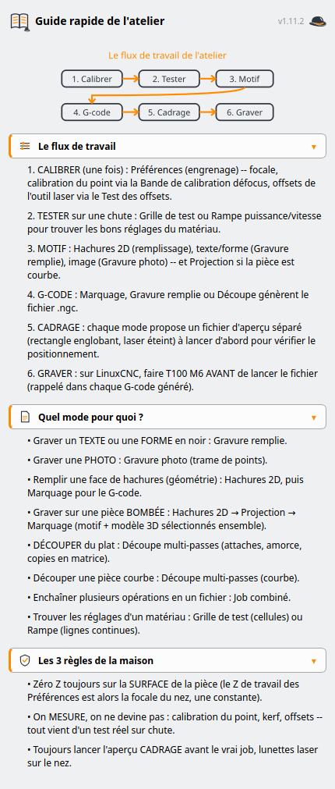

## Gravure à plat

### Hachures 2D (géométrie)
Remplit une face de hachures (parallèles / croisées / défocus) — géométrie seule, à graver ensuite avec le Marquage.

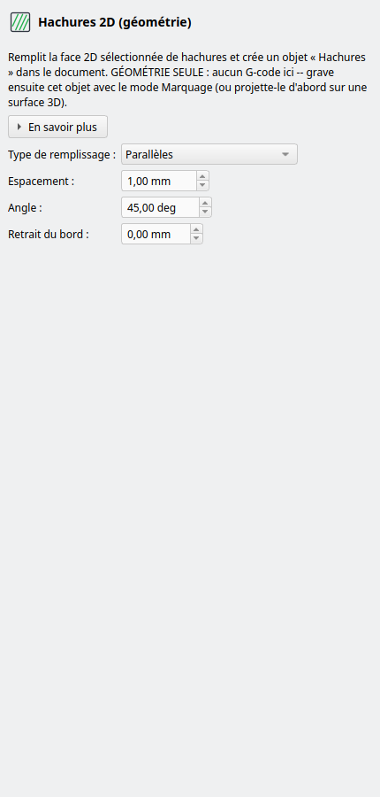

### Gravure remplie (noir)
Texte/forme en noir plein : remplissage défocus rentré du bord + contour net, styles de trait, compensation puissance/défocus.

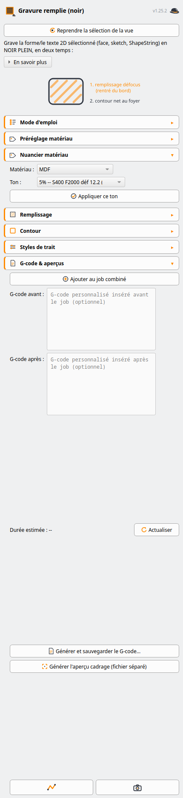

### Gravure photo (trame de points)
Image → trame de points laser (diffusion Floyd-Steinberg ou durée variable), aperçu du tramage en direct.

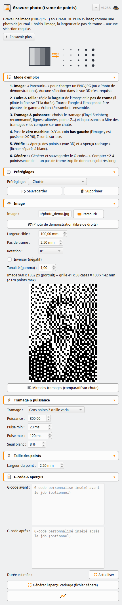

## Sur surface 3D

### Projection sur surface 3D
Motifs 2D projetés sur une surface courbe — on sélectionne pendant que le panneau est ouvert, état affiché en direct.

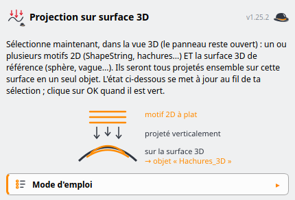

### Marquage de motif (plat ou courbe)
Grave un motif filaire, à plat ou en suivant le relief, avec les 5 styles de trait et le nuancier.

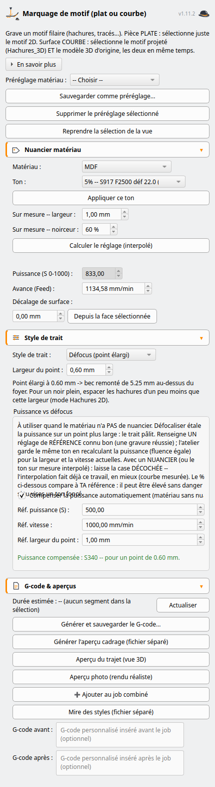

### Découpe multi-passes (courbe)
Découpe en plusieurs passes en suivant le relief d'une surface courbe.

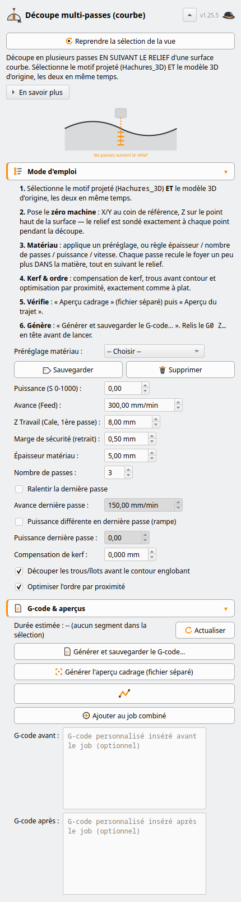

## Découpe

### Découpe multi-passes (matériau plat)
Passes progressives, kerf, trous d'abord, attaches, amorce, copies en matrice.

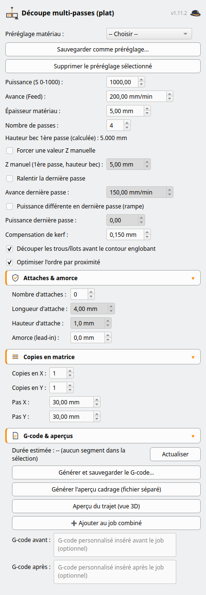

## Tests & calibration

### Calibration kerf
Carré test pour mesurer le kerf réel.

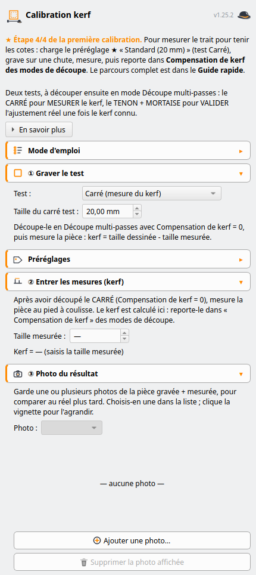

### Grille de test puissance/vitesse
Matrice de cellules S×F étiquetée, hauteur (Z) de test réglable.

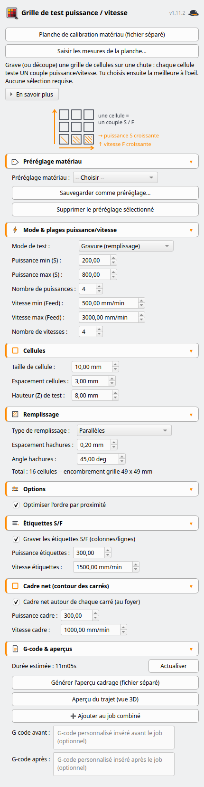

### Test rampe puissance/vitesse (lignes)
Lignes continues, une par vitesse, puissance croissante (et rampe Z optionnelle), règle graduée.

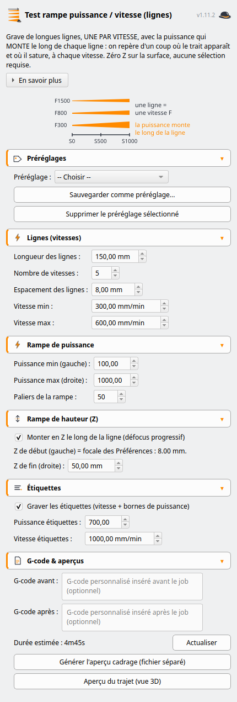

### Bande de calibration défocus
Traits à hauteurs croissantes pour mesurer le foyer et la divergence — alimente la calibration des Préférences.

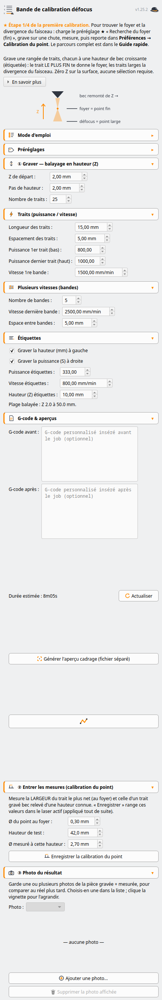

### Test des offsets X/Y du laser
Job mixte fraise + laser : l'écart entre les deux croix corrige `tool.tbl`.

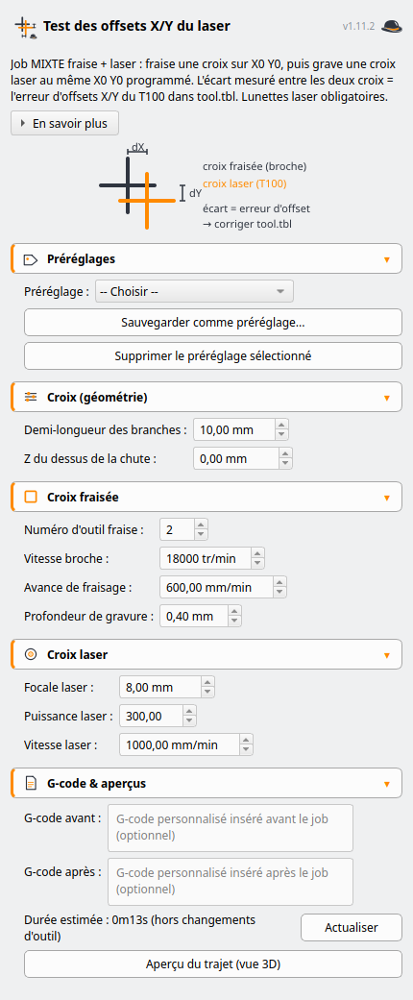

### Nuancier matériau
La palette de gris mesurée d'un matériau (tons noirceur/S/F/défocus/largeur), appliquée d'un clic dans les modes.

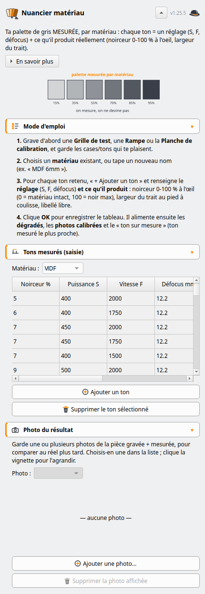

## Assemblage & réglages

### Job combiné
Plusieurs opérations dans un seul fichier G-code, un seul armement.

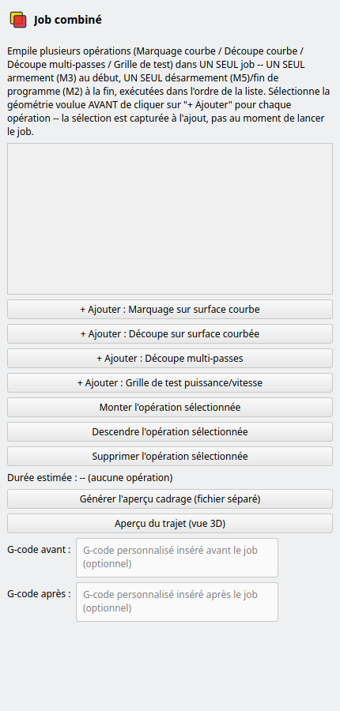

### Préférences
Tous les réglages machine centralisés : calibration du point, Z de travail, fluence, bec, sécurité…

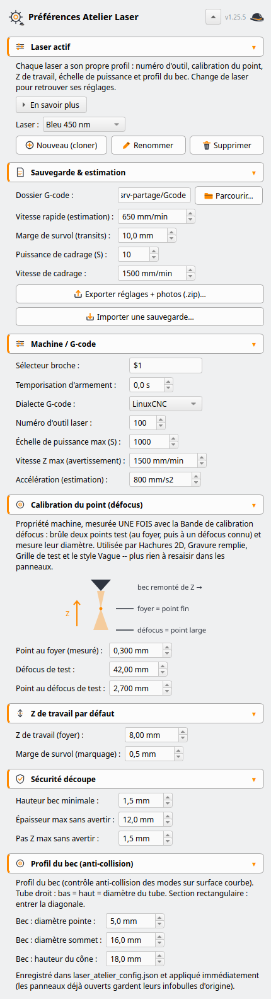
