# Les panneaux de l'atelier

> 📖 Pour la **documentation complète en images** (présentation, installation, flux de travail, calibration, FAQ…), voir [`index.html`](index.html) — la page web de l'atelier, prête pour GitHub Pages. Cette galerie-ci ne rassemble que les captures brutes de chaque panneau.

Captures d'écran de chaque mode (panneau complet, largeur réelle du panneau des tâches).

Pour les régénérer après une évolution de l'interface, **sans toucher à la session FreeCAD
ouverte** — une seule commande, qui refait la galerie ci-dessous ET les images du manuel :

```bash
python3 tests/lancer.py --captures
```

```bash
python3 tests/lancer.py --captures halftone
```

La seconde forme n'en refait qu'un. Le lanceur passe par le même harnais que les tests, donc
la config est redirigée vers une **copie jetable** : capturer ne peut pas écrire dans les
mesures prises au pied à coulisse. Il impose aussi les fontes du système — sans elles Qt
retombe sur une chasse fixe et les ①②③ des sections sortent en « 0 », une capture
lisible mais qui ne ressemble plus aux autres. Chaque panneau est instancié hors écran et
recadré en bas. Largeurs de la maison : **453** px ici, **430** px pour `docs/manuel_img/`
(le manuel).

> L'ancienne recette — `outils/capturer_panneau.py` lancé à la main avec le python d'une
> AppImage montée — pilotait la vraie config et citait un chemin `/tmp/.mount_FreeCA…` qui
> change à chaque lancement de FreeCAD. Elle ne vaut plus depuis que ce poste tourne le
> **paquet système** (16/08/2026).

## Découverte

### Guide rapide
Le point d'entrée : flux de travail en 6 étapes, « quel mode pour quoi ? », règles de la maison.

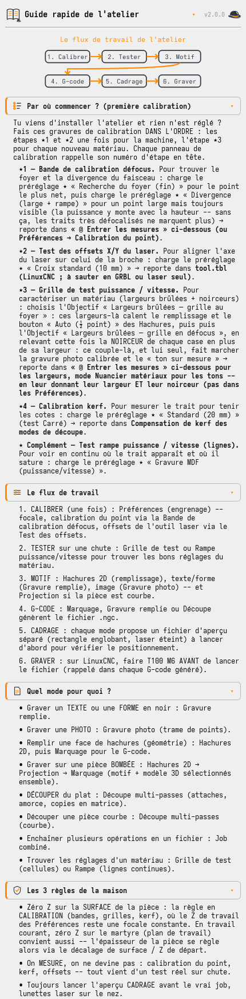

## Import de dessins

### Importer un dessin SVG
Lit le `.svg` directement et crée **un objet par tracé d'origine**, sélectionnable individuellement — sans le détour par le DXF, qui émiettait un crâne de 23 tracés en plus de 210 fragments. La couleur de remplissage est reprise sur l'objet, pour les distinguer à l'œil.

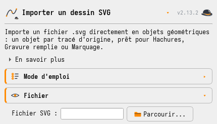

## Gravure à plat

### Hachures 2D (géométrie)
Remplit une face de hachures (parallèles / croisées / défocus) — géométrie seule, à graver ensuite avec le Marquage.

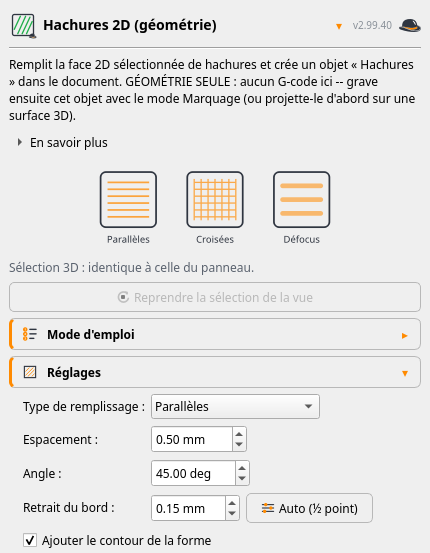

### Texte (trait simple)
Du texte en police **mono-trait** : une seule passe de plume par branche, pas un contour rempli. 45 polices (EMS 29, Hershey 13, Twin Sans, Relief SingleLine — OFL ou domaine public — plus **Verdier**, dessinée pour l'atelier : chapeau melon sur `¤`, œ et Œ tracés), et le bouton « Voir… » les écrit toutes avec votre texte pour choisir en les voyant. Crée un objet fil, à graver ensuite avec Marquage.

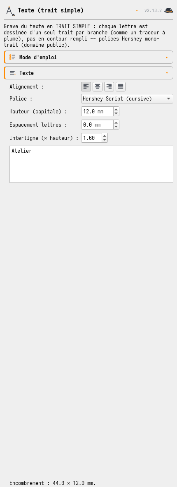

### Calligraphie (pleins et déliés)
Un texte gravé dans une **vraie police calligraphique** (`.otf`/`.ttf` lue sur votre disque) en un seul passage : on extrait le squelette de la lettre et sa largeur locale, et la largeur devient une **hauteur Z** — la tête se lève pour élargir le trait dans les pleins, redescend pour les déliés. Le verdict dit si les pleins demandés tiennent dans ce que le matériau sait donner, et propose la taille qui les ferait tenir.

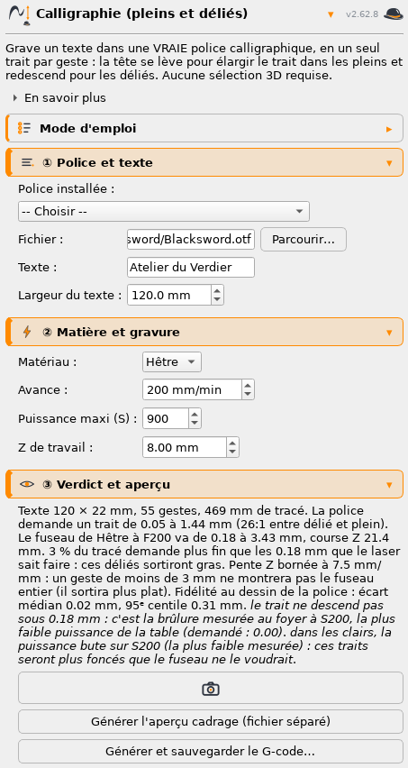

### Texte gravé (contour)
Le pendant du précédent pour les polices **classiques**. Une calligraphie est le dessin d'une plume — son axe médian *est* le geste ; une police classique n'a pas de plume, son **contour est son dessin**, et en extraire un axe réduirait les empattements à de petites barres. Ce mode trace donc le pourtour exact du glyphe, pris sur les vraies courbes de la police, à graver ensuite avec **Marquage** (lettres creuses) ou **Gravure remplie** (lettres pleines) — les contreformes se creusent toutes seules.

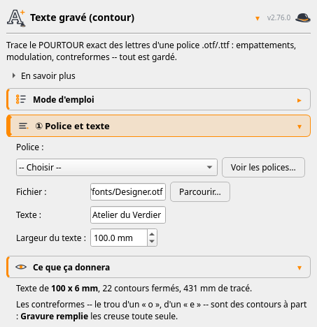

### Gravure remplie (noir)
Texte/forme en noir plein : remplissage défocus rentré du bord + contour net, styles de trait, compensation puissance/défocus.

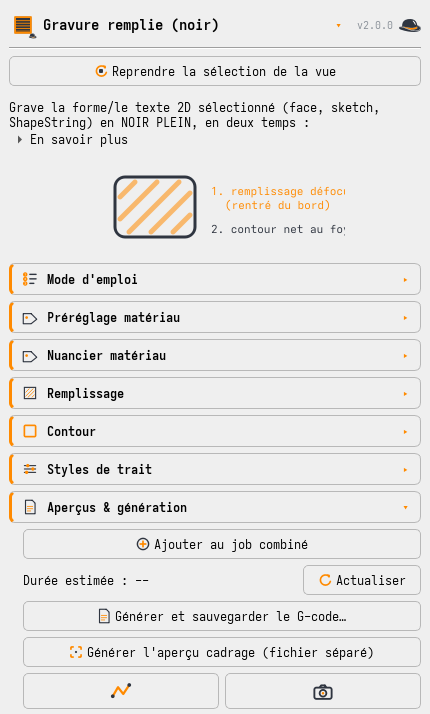

### Gravure photo (trame de points)
Image → trame de points laser (diffusion Floyd-Steinberg ou durée variable), aperçu du tramage en direct.

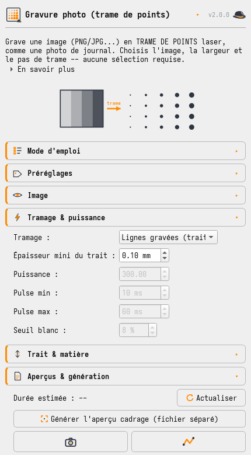

## Sur surface 3D

### Projection sur surface 3D
Motifs 2D projetés sur une surface courbe — on sélectionne pendant que le panneau est ouvert, état affiché en direct.

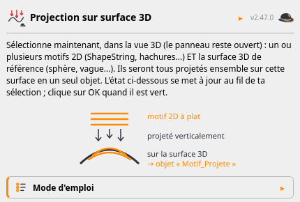

### Marquage de motif (plat ou courbe)
Grave un motif filaire, à plat ou en suivant le relief, avec les 5 styles de trait et le nuancier.

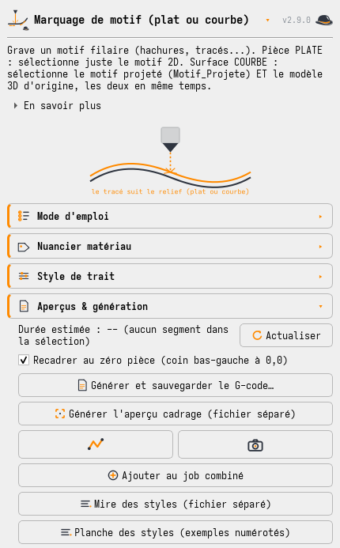

### Découpe multi-passes (courbe)
Découpe en plusieurs passes en suivant le relief d'une surface courbe.

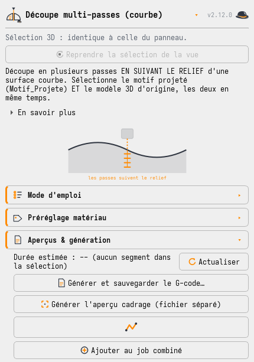

## Découpe

### Découpe multi-passes (matériau plat)
Passes progressives, kerf, trous d'abord, attaches, amorce, copies en matrice.

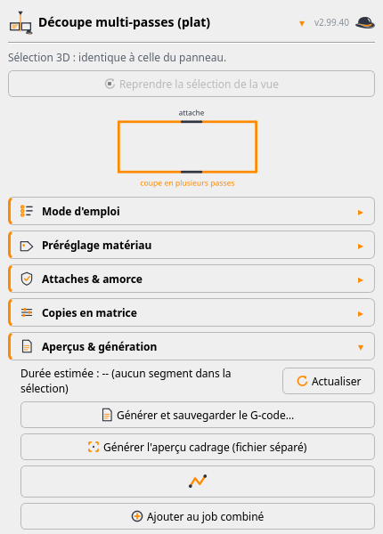

## Tests & calibration

### Assistant matériau
Caractériser un matériau du début à la fin, dans l'ordre : graver les trois planches, saisir les mesures (au pied à coulisse ou **sur la photo redressée**, le cadrage de chaque trait étant calculé), puis en déduire largeurs, espacements et régimes. C'est d'ici que sort la table de brûlures dont dépendent le défocus, le fuseau Z et la calligraphie.

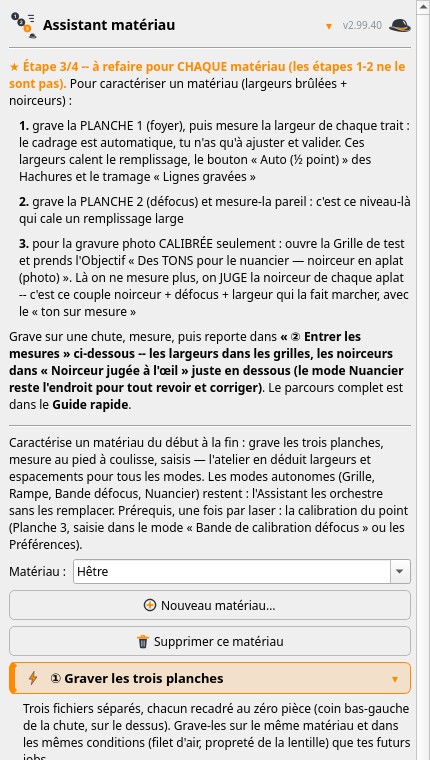

### Calibration kerf
Carré test pour mesurer le kerf réel.

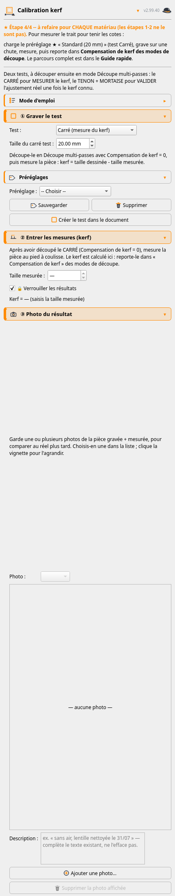

### Grille de test puissance/vitesse
Matrice de cellules S×F étiquetée, hauteur (Z) de test réglable.

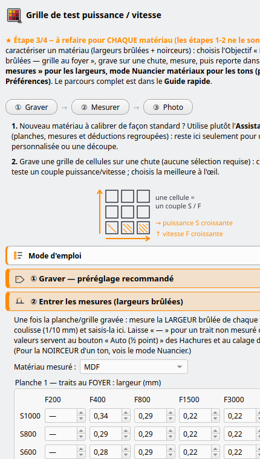

### Test rampe puissance/vitesse (lignes)
Lignes continues, une par vitesse, puissance croissante (et rampe Z optionnelle), règle graduée.

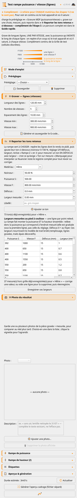

### Bande de calibration défocus
Traits à hauteurs croissantes pour mesurer le foyer et la divergence — alimente la calibration des Préférences.

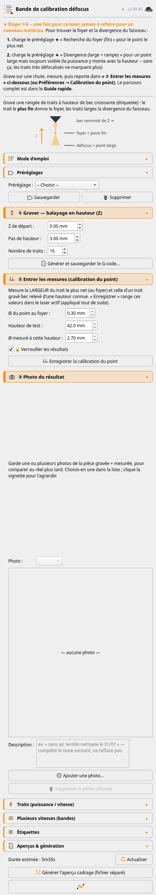

### Test des offsets X/Y du laser
Job mixte fraise + laser : l'écart entre les deux croix corrige `tool.tbl`.

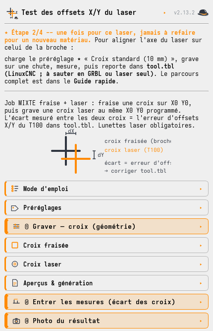

### Nuancier matériau
La palette de gris mesurée d'un matériau (tons noirceur/S/F/défocus/largeur), appliquée d'un clic dans les modes.

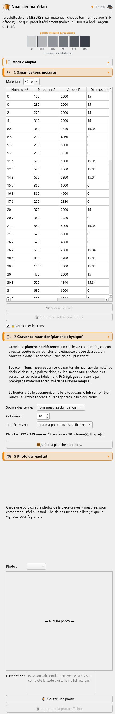

### Catalogue (planche d'exemples)
Une planche d'**exemples** gravée en un seul job : styles de Marquage, texte mono-trait, gravure remplie, chacun étiqueté avec ses réglages. À garder sur l'établi — c'est l'échantillonnier auquel on compare une idée avant de la graver en grand.

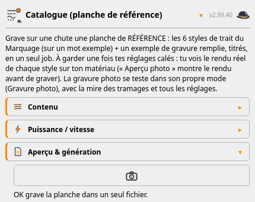

## Assemblage & réglages

### Job combiné
Plusieurs opérations dans un seul fichier G-code, un seul armement.

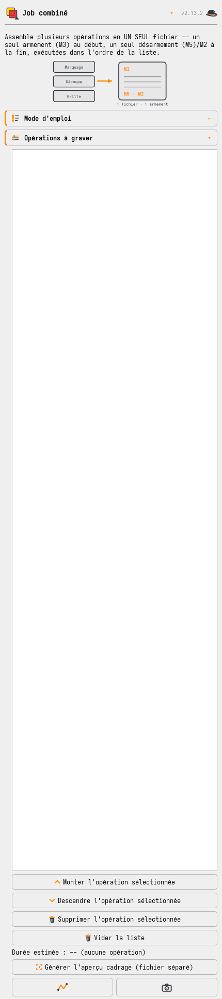

### Préférences
Tous les réglages machine centralisés : calibration du point, Z de travail, fluence, bec, sécurité…

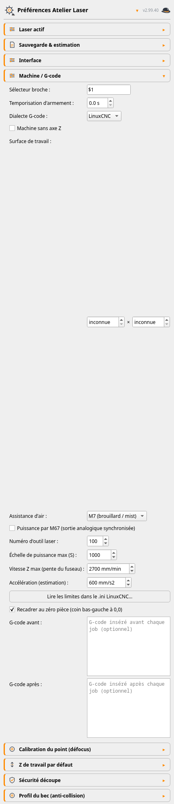
